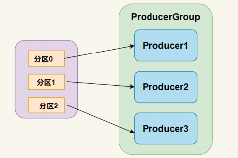
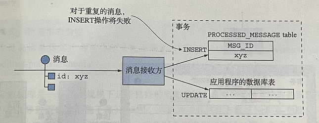

# 消息队列

> 消息队列是基于**消息代理**的消息传递架构。在第一部分将介绍消息队列的优点，之后将具体介绍Kafka的架构设计

## 1. 基于代理的消息

消息代理是所有消息的中介节点。**生产者将消息写入消息代理，消息代理将消息发送给消费者**。

有许多消息代理可以选择，流行的开源消息代理包括：

- Kafka
- RabbitMQ
- RocketMQ

每种消息队列都有自己与众不同的概念来实现消息通道，例如Kafka有主题、分区、消费者组等。

消息代理的好处：

- 松耦合：客户端发起请求时只要发送给特定的消息通道即可，无需感知消费者实例的情况，不需要服务发现机制去获得服务实例的位置
- 消息缓存：消息代理可以在消息被处理之前一直缓存消息。像HTTP这样的同步请求响应协议，在交换数据时，发送方和接收方必须同时在线。然后使用消息队列时，消息会在队列中缓存，直到它们被接收方处理。

## 2. 消息架构需要解决的问题

### 2.1 消息顺序

使用多个线程和服务实例可以提高系统的吞吐量。**但同时要确保每个消息只能被处理一次，并且是按照它们发送的顺序来处理的。**

例如：有3个相同的接收方实例从同一个点对点通道读取消息，发送方按顺序发布Order Created，Order Updated，Order Cancelled这3个事件消息。消息实现可能会将不同的消息发给不同的接收方，这将导致一个问题，消息可能没有按照消息发送的顺序被处理。理论上，服务实例可能会在另一个服务处理Order Created消息之前处理Order Cancelled。

现代的消息处理框架（例如Kafka）使用的常见方案是使用**分区**通道

- 发送方在消息头部指定分区键，通常是任意的字符串或字节序列。消息队列使用分区键将消息分给特定的分区。

- 消息队列将接收方的多个实例组合在一起，例如Kafka使用术语**消费者组**。将每个分区分配给单个消费者

在此示例中，每个Order事件消息都将orderId作为其分区键，特定订单的每个事件都将发布到同一个分片，而且该分片中的消息始终由同一个消费者实例读取。

### 2.2 处理重复消息

使用消息机制时必须要解决的另一个问题是处理重复消息。理想情况下，消息代理应该只传递一次消息，但保证有且仅有一次的消息传递通常成本很高。**相反，大多数消息代理至少成功传递一次**

处理重复消息有以下两种不同的方法：

- 编写幂等消息处理程序
- **跟踪消息并丢弃重复项**

> 在编程中，幂等操作的特点就是任意多次执行所产生的影响均与一次执行的影响相同。

满足幂等（idempotent）的消息处理程序可以被放心地执行多次，但是大多数应用程序逻辑通常不是幂等的。在这种情况下，编写跟踪消息并丢弃重复项的消息处理程序。

#### 跟踪消息并丢弃重复项

一个简单的解决方案是消息接收方使用message id跟踪它已处理的消息并丢弃重复项。

消费者处理消息时，接收方将包含message_id的行出入消息处理表中，如果消息是重复的，则INSERT将失败，消费者可以选择丢弃该消息。

Kafka 消费消息时支持三种模式：

- `at most once` 模式 最多一次。保证每一条消息 commit 成功之后，再进行消费处理。消息可能会丢失，但不会重复。

- `at least once` 模式 至少一次。保证每一条消息处理成功之后，再进行 commit。消息不会丢失，但可能会重复。
- `exactly once` 模式 精确传递一次。将 offset 作为唯一 id 与消息同时处理，并且保证处理的原子性。消息只会处理一次，不丢失也不会重复。但这种方式很难做到。

Kafka 默认的模式是 at least once ，但这种模式可能会产生重复消费的问题，所以在**业务逻辑必须做幂等设计。**

在业务场景保存数据时使用了 INSERT INTO ...ON DUPLICATE KEY UPDATE 语法，不存在时插入，存在时更新，是天然支持幂等性的。