# 项目前端记录

> 记录项目开发中遇到的前端细节

## 1. Echarts

### 1.1 模拟数据案例

- 项目导入echarts

  ~~~java
  npm install echarts
  ~~~

  如果报错`npm ERR! ERESOLVE unable to resolve dependency tree`，则使用以下指令

  ~~~js
  npm install --legacy-peer-deps
  ~~~

- 在`main.js`中声明

  ~~~js
  import echarts from 'echarts'              // 导入echarts
  Vue.prototype.$echarts = echarts           // 全局组件
  ~~~

- 声明组件

  ~~~vue
  <template>
    

      <el-card>
        

      </el-card>
      <el-card>
        

      </el-card>
    

  </template>
  
  
  
  ~~~

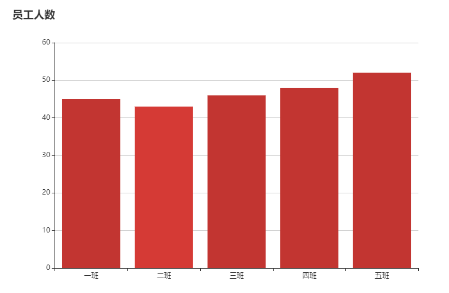

### 1.2 后端数据案例

- controller层代码

  ~~~java
  @RequestMapping("/dataPie")
  public R selectDataPie(){
      List<DataPieVo> dataPie = collectDataService.findDataByCategory();
      return R.ok().put("dataPie", dataPie);
  }
  ~~~

- service层代码

  ~~~java
  @Override
  public List<DataPieVo> findDataByCategory() {
      // DTO数据 {id: 设备id, value: 数据总数}
      List<CollectDataView> collectDataViews = collectDataDao.selectCountByMachine();
      // VO数据局 {name: 设备名字, value: 数据总数}
      List<DataPieVo> collectDataVos = new ArrayList<>();
      // dto -> vo 转换
      for (CollectDataView collectDataView : collectDataViews) {
          DataPieVo pieVo = new DataPieVo();
          switch (collectDataView.getId()){
              case 1:
                  pieVo.setName("fNirs红外线仪");
                  pieVo.setValue(collectDataView.getValue());
                  break;
              case 2:
                  pieVo.setName("eeg设备");
                  pieVo.setValue(collectDataView.getValue());
                  break;
              case 3:
                  pieVo.setName("emg设备");
                  pieVo.setValue(collectDataView.getValue());
                  break;
              default:
                  break;
          }
          collectDataVos.add(pieVo);
      }
      return collectDataVos;
  }
  ~~~

- dao层代码

  ~~~java
  <select id="selectCountByMachine" resultType="io.renren.modules.medical.dto.CollectDataView">
          SELECT collect_machine_id as id, COUNT(*) as value
          FROM medical_collect_data
          GROUP BY collect_machine_id;
  </select>
  ~~~

- 前端代码

  ~~~js
  monted() {
      this.$http({
          url: this.$http.adornUrl('/medical/collectdata/dataPie'),
          method: 'post',
      	data: this.$http.adornData()
      }).then(({data}) => {
          if (data && data.code === 0) {
              this.collectData = data.dataPie;
              // 调用方法
              this.drawPie();
          } else {
              this.collectData = [];
          }
      })
  }
  method: {
  	drawPie(){
          var myChart2 = this.$echarts.init(document.getElementById('main2'))
          myChart2.setOption({
            title: {
              text: '数据分布'
            },
            tooltip: {
              trigger: 'item',
              formatter: "{c}条记录 ({d}%)"//模板变量有 {a}、{b}、{c}、{d}，分别表示系列名，数据名，数据值，百分比。
            },
            legend: {
                orient: 'horizontal',
                left: 'right',
                data:['fNirs红外线仪','eeg设备','emg设备']
            },
            label: {
              normal: {
                  show: true,
                  position: 'inside',
  				//模板变量有 {a}、{b}、{c}、{d}，分别表示系列名，数据名，数据值，百分比。{d}数据会根据value值计算百分比
                  formatter: '{b}',
  
                  textStyle : {                   
                  align : 'center',
                  baseline : 'middle',
                  fontFamily : '微软雅黑',
                  fontSize : 15,
                  fontWeight : 'bolder'
                }
              },
            },
            series:[{
              type: 'pie',
              data: this.collectData,
              avoidLabelOverlap: false,
            }]
          })
        }
  }
  ~~~

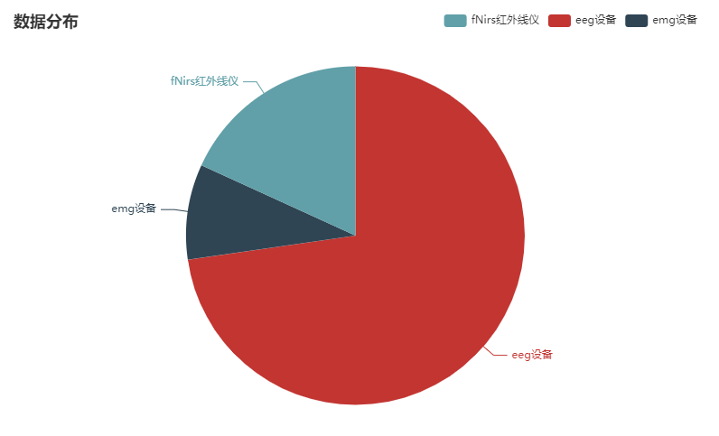

## 2. 动态路由

在renren-fast项目中增加一个页面

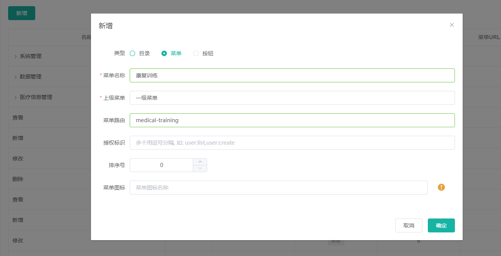

操作完之后会在库表`sys-menu`中增加该页面的权限

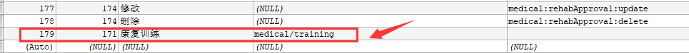

在前端项目中增加training.vue文件

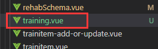

在vue文件中测试一下

~~~vue
<template>
    <h1>hello world</h1>
</template>
~~~

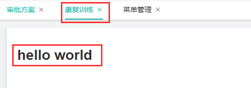

## 3. v-for遍历对象

在使用`v-for`遍历对象（不是数组），会发现无法**即时动态渲染。**

这种问题不会在遍历数组中出现，因为遍历数组通常直接使用了`item`

有如下的业务需求：

​	需要记录训练记录的各种情况，由治疗师自己动态的增加评价项，如下所示：

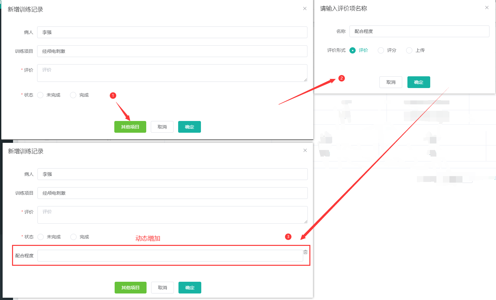

出现了问题：

​	**无法在输入框输入（实际上是未即时显示）**

~~~vue
<!-- 遍历js对象 -->

    <el-col>
        <el-form-item :label="key">
            <!-- 双向绑定value['content'] -->
            <el-input v-model="value['content']" v-if="value['type']===1"></el-input>
            <el-rate v-model="value.content" show-score  v-if="value['type']===2"></el-rate>
         </el-form-item>
    </el-col>

~~~

最终的数据对象如下所示

~~~json
{
 "熟练程度": 
 	{
        "type": 1, 
        "content": ""
    }
}
~~~

如上述代码所示，本意是通过`v-model='value['content']'`修改了value中的值。

**问题是什么？**

**遍历对象时使用object[key]，vue无法动态渲染（具体表现为<el-input>输入框无法即时显示）**

只有触发以下条件时会触发此问题：

1. 输入框所在的页面数据为二次加载
2. v-model绑定的属性为复杂数据类型内属性

使用@input方法调用`$forceUpdate()`进行强制更新渲染

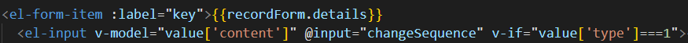

~~~js
changeSequence(){
    this.$forceUpdate();
}
~~~

## 4. 上传文件的优化

现有的上传流程是：

1. 上传文件到云服务器
2. 云服务器返回一个url
3. url与其他信息（实验时间，操作人等数据）发送给服务器

优化前：

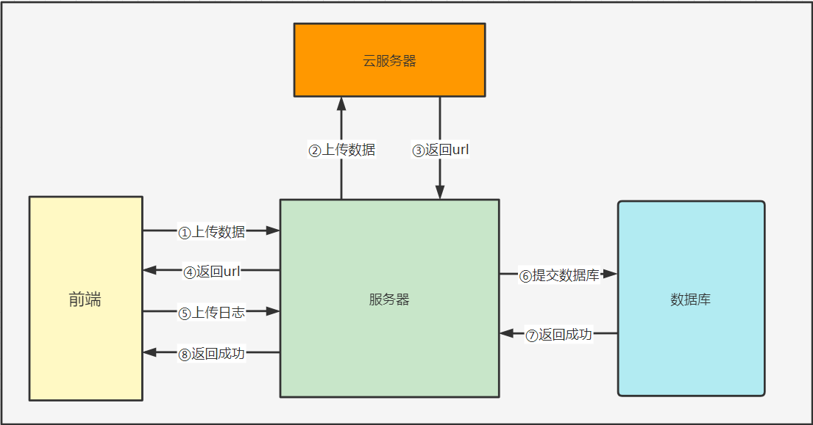

优化后：

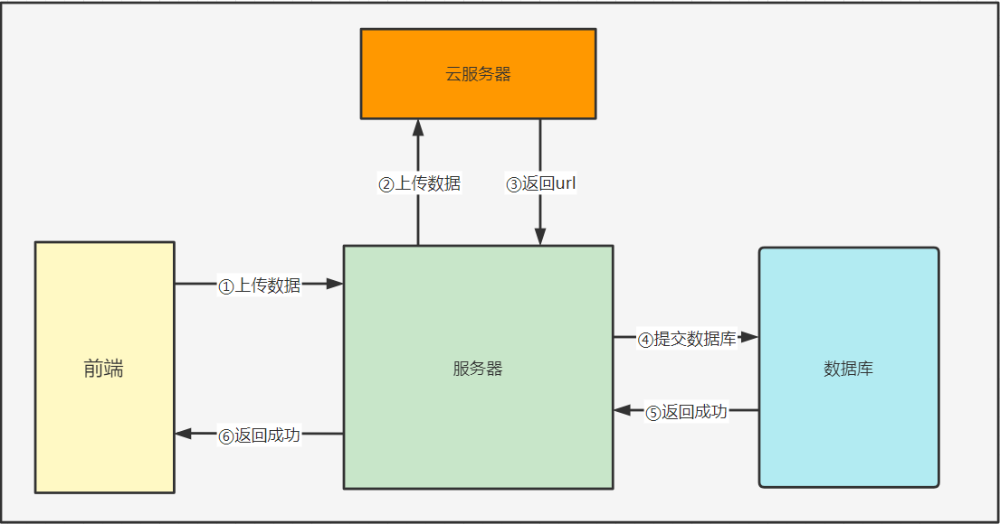

### 1. Kafka的使用

#### 1.1 启动zookeeper

~~~bash
docker run -d --name zookeeper -p 2181:2181 -t wurstmeister/zookeeper
~~~

#### 1.2 启动Kafka

~~~bash
docker run -d --name kafka --publish 9092:9092 --link zookeeper --env KAFKA_ZOOKEEPER_CONNECT=zookeeper:2181 --env KAFKA_ADVERTISED_HOST_NAME=你的宿主ip --env KAFKA_ADVERTISED_PORT=9092 --volume /etc/localtime:/etc/localtime wurstmeister/kafka
~~~

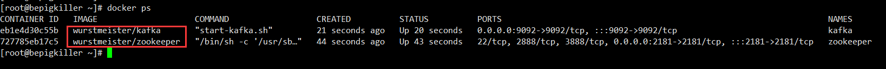

#### 1.3 进入kafka容器

~~~bash
docker exec -it kafka /bin/bash
~~~

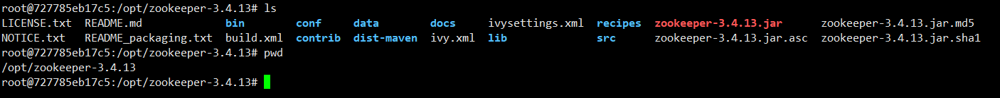

#### 1.4 创建主题

进入`/opt/kafka/bin`

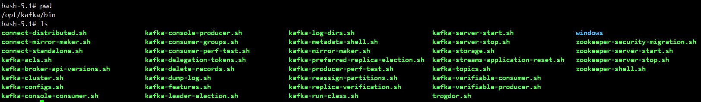

创建test主题

~~~bash
bin/kafka-topics.sh --create --zookeeper zookeeper:2181 --replication-factor 1 --partitions 1 --topic test
~~~

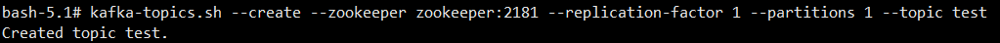

查看zookeeper下的topic列表

~~~bash
bash-5.1# kafka-topics.sh --list --zookeeper zookeeper:2181
test
~~~

#### 1.5 生产者与消费者发送消息

- 生产者

~~~bash
bash-5.1# kafka-console-producer.sh --broker-list localhost:9092 --topic test
>你好啊
~~~

- 消费者

~~~bash
bash-5.1# kafka-console-consumer.sh --bootstrap-server localhost:9092 --topic test --from-beginning
你好啊
~~~

SpringBoot 2.x在进行[单元测试](https://so.csdn.net/so/search?q=单元测试&spm=1001.2101.3001.7020)的时候，**不支持.yml文件**

