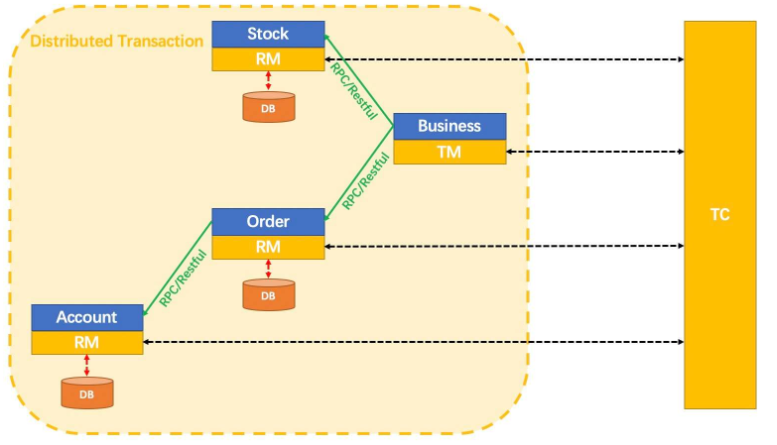
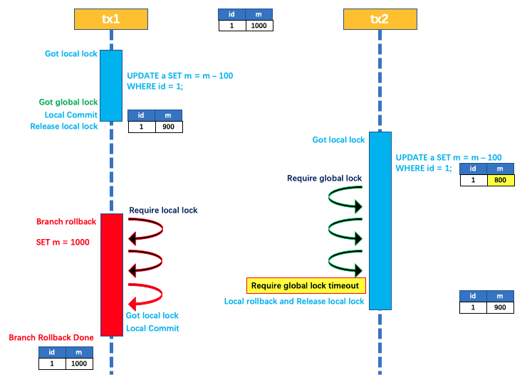

# 分布式事务

## 1. 全局事务

> 在这篇笔记中，全局事务被限定为**单个事务使用多个数据源的场景**的事务解决方案，这里仍然追求"强一致性"的事务处理方案

### 1.1 使用场景

以编程式事务实现下面一个场景：用户、商家、仓库分别处以不同的数据库（数据源）中，"用户购买了一本书"的事务如何编码？


~~~java
public void buyBook(PaymentBill bill) {
    // 1.开启用户、商家、仓库三个事务
  	userTransaction.begin();
    warehouseTransaction.begin();
    businessTransaction.begin();
  try {
      // 2.业务处理
      userAccountService.pay(bill.getMoney());
      warehouseService.deliver(bill.getItems());
      businessAccountService.receipt(bill.getMoney());
      // 3.提交事务
      userTransaction.commit();
      warehouseTransaction.commit();
      businessTransaction.commit();
  } catch(Exception e) {
      // 4.业务出错回滚
      userTransaction.rollback();
      warehouseTransaction.rollback();
      businessTransaction.rollback();
  }
}
~~~

看出程序的目的是要做三次事务提交，但实际代码并不能这样写。

设想这样一个场景：如果程序运行到 `businessTransaction.commit()` 中出现错误，会跳转到 catch 块中继续执行，这时候 `用户事务` 和 `仓库事务` 已经提交了，再去调用 rollback() 方法已经无济于事，这将导致一部分数据被提交，另一部分被回滚，无法保证整个事务的一致性。

### 1.2 两段式提交(2PC)

为了解决上述的问题，XA事务将事务的提交拆分成了两阶段

- **准备阶段**：协调者询问事务的所有参与者是否准备好提交，参与者如果已经准备好则回复Prepared，否则回复None-Prepared。

  "准备操作"指的是在数据库的重做日志中记录了一个事务所作出的所有修改，但还没有Commit Record。

  Commit Record：指令用来声明重做日志已经将事务持久化到磁盘了，数据库只有看到该指令后才会将内存中的脏页持久化到磁盘

- **提交阶段**：协调者如果在准备阶段收到所有事务参与者回复的 Prepared 消息，就会首先在本地持久化事务状态为 Commit，然后向所有参与者发送 Commit 指令，所有参与者立即执行提交操作；否则，任意一个参与者回复了 Non-Prepared 消息，或任意一个参与者超时未回复，协调者都会将自己的事务状态持久化为“Abort”之后，向所有参与者发送 Abort 指令，参与者立即执行回滚操作。


以上这两个过程称为"两段式提交(2 Phase Commit，2PC)"协议

两段式提交虽然原理简单，但有几个显著的问题：

1. **单点问题**：参与者在等待协调者的指令时无法做超时处理。一旦协调者宕机，在收到协调者的Commit或Abort指令前，所有的参与者必须一直等待。
2. **性能问题**：两段式提交涉及3个持久化过程（重做日志持久化，协调者事务状态持久化，参与者Commit Record写入提交记录）整个过程将持续到参与者集群中最慢的那一个操作结束为止。<font color=red>**可用性不高.**</font>
3. **数据不一致问题**：协调者收到了所有参与者的Prepared信息后，会发送Commit至所有的参与者，并持久化事务状态为Commit，如果此时发生网络问题参与者无法接收到Commit指令，那么就会导致部分数据已经提交（协调者），部分数据未提交（参与者）

### 1.3 三段式提交(3PC)

> 为了解决两段式中的缺陷，具体来说是协调者的单点问题和准备阶段的性能问题，后续又发展出了"三段式提交"协议

三段式提交（3 Phase Commit，3PC）把两段式提交的准备阶段又分为两个阶段，分别称为"Can Commit"和"Pre Commit"，把提交阶段改称为"Do Commit"阶段

- **Can Commit 阶段**：协调者让每个参与的数据库根据自身的状态，评估事务是否有可能顺利完成
- **Pre Commit 阶段**：写入重做日志，<font color=red>**锁定数据资源**</font>。和两段式的准备阶段一样
- **Do Commit 阶段**：提交事务，<font color=red>**释放数据资源锁**</font>。和两段式的提交阶段一样

增加了一轮询问阶段，如果得到了正面的响应，那事务能够成功提交的把握就比较大了，这也就意味着某个参与者提交时发生崩溃而导致大家全部回滚的风险相对较小。

如果事务需要回滚，三段式提交的性能较好（fail fast），但在事务能够成功提交的场景下，两者的性能较差，甚至三段式因为多了一次询问，还要稍微更差一些。

同样由于事务回滚的概率变小，在三段式提交中，如果在 Pre Commit 阶段后协调者发生了宕机，那么参与者默认的策略是提交事务而不是回滚事务或者持久等待，避免了单点式的问题。


可以看出，**三段式提交对单点问题和回滚时的性能问题有所改善，但是对一致性风险问题并未有任何改进，甚至是增加了面临的一致性风险**。

我们看一个例子。比如，进入 Pre Commit 阶段之后，协调者发出的指令不是 Commit 而是 Abort，而此时因为网络问题，有部分参与者直至超时都没能收到协调者的 Abort 指令的话，这些参与者将会错误地提交事务，这就产生了不同参与者之间**数据不一致**的问题。

### 1.4 场景比喻

学校组织知识竞赛，学生们（参与者）以一组为单位参加比赛，由一个监考老师（协调者）负责监考。 

考试分为考卷和答题卡，学生必须先在十分钟内把答案写在考卷上（记录日志），然后在三分钟内把答案涂到答题卡上（提交事务）。 

两段式提交： 

准备阶段：老师宣布：“开始填写考卷，时间十分钟”。 十分钟内，写好考卷的学生就回答：Prepared，十分钟一到，动作慢，还没写好学生，就回答：Non-Prepared。 如果有学生回答Non-Prepared，该小组被淘汰。  

提交阶段：如果所有的学生都回答了Prepared，老师就会在笔记本上记下，“开始填答题卡”（Commit），然后对所有的学生说：“开始填答题卡”（发送 Commit 指令）。 

学生听到指令后，就开始根据考卷去涂答题卡。 如果学生在涂答题卡的时候，过于紧张把答题卡涂错了，还可以根据考卷重新涂。 如果所有的学生在规定时间内都填好了答题卡，老师宣布该小组考试通过。 

三段式提交 

Can Commit阶段：老师先给学生看一下考卷，问问学生能不能在十分钟内做完。如果有学生说没信心做完，该小组直接淘汰

Pre Commit阶段：如果学生都说能做完，老师就宣布：“开始填写考卷，时间十分钟”，和两段式提交的准备阶段一样。 

Do Commit阶段：和两段式提交的提交阶段一样。

## 2. 分布式事务

> 从本节开始，分布式事务指的是**多个服务同时访问多个数据源的事务处理机制**

### 2.1 CAP理论与ACID的矛盾

CAP 理论是分布式计算领域公认的著名定理，这个定理描述了一个分布式的系统中，当涉及到`共享数据问题`时，以下三个特性最多只能满足其中两个：

**一致性（Consistency）**：代表在任何时刻、任何分布式节点中，我们所看到的数据都是符合预期的。在分布式事务中，ACID 的 C 要以满足 CAP 中的 C 为前提。

**可用性（Availability）**：代表系统不间断地提供服务的能力。可用性衡量系统可以正常使用的时间与总时间之比。

**分区容忍性（Partition Tolerance）**：代表分布式环境中，当部分节点因网络原因而彼此失联（即与其他节点形成“网络分区”）时，系统仍能正确地提供服务的能力。


选择放弃一致性的AP系统是目前设计分布式系统的主流选择，**因为P是分布式网络的天然属性，你再不想要也无法丢弃；而A是建设分布式的目的，如果可用性随着节点数量的增加反而降低的话，很多分布式系统就失去了存在的意义。**

除非是银行、证券这些涉及金钱交易的服务，宁愿中断也不能出错，否则多数系统时不能容忍节点越多可用性反而越低的。

目前大多数NoSQL库和支持分布式的缓存框架都是AP系统，以 Redis 集群为例，如果某个 Redis 节点出现网络分区，那也不妨碍每个节点仍然会以自己本地的数据对外提供服务。但这时有可能出现这种情况，即请求分配到不同节点时，返回给客户端的是不同的数据。

**在分布式环境中，“一致性”却不得不成为了通常被牺牲、被放弃的那一项属性。**

但无论如何，我们建设信息系统，终究还是要保证操作结果（在最终被交付的时候）是正确的。为此，人们又重新给一致性下了定义，把前面我们在 CAP、ACID 中讨论的一致性称为“强一致性”（Strong Consistency），有时也称为“线性一致性”（Linearizability），<font color=red>**而把牺牲了 C 的 AP 系统，又要尽可能获得正确的结果的行为，称为追求“弱一致性”。**</font>

在弱一致性中，人们又总结出了一种特例，叫做“**最终一致性**”（Eventual Consistency）。

它是指，如果数据在一段时间内没有被另外的操作所更改，那它最终将会达到与强一致性过程相同的结果。

<font color=red>**最终一致性允许：可以在一段时间内每个节点的数据不一样，但是经过一段时间后每个节点的数据必须一致。**</font>

因此在分布式事务中，目标从本地事务、全局事务追求的"强一致性"，降低为追求获得"最终一致性"。

由于一致性的定义变动，“事务”一词的含义也已经被拓宽了，那就是针对追求 ACID 的事务，我们称之为“刚性事务”。而在接下来将要介绍的几种分布式事务的常见做法，会统称为“柔性事务”。

### 2.2 可靠的事件队列

#### 2.2.1 概念

BASE是达成最终一致性的途径：

- **B**asically **A**vailable：基本可用
- **S**oft State：软状态
- **E**ventually Consistent：最终一致性

继续以场景示例解释"可靠事件队列"的具体做法，目标仍然是在交易的过程中正确修改账号、仓库和商家服务中的数据。


1. 最终用户向 Fenix's Bookstore 发送交易请求：购买一本价值 100 元的《深入理解 Java 虚拟机》。
2. Fenix's Bookstore 应该对用户账户扣款、商家账户收款、库存商品出库这三个操作有一个出错概率的先验评估，**根据出错概率的大小来安排它们的操作顺序**（这个一般体现在程序代码中，有一些大型系统也可能动态排序）。比如，最有可能出错的地方，是用户购买了，但是系统不同意扣款，或者是账户余额不足；其次是商品库存不足；最后是商家收款，一般收款不会遇到什么意外。那么这个顺序就应该是最容易出错的最先进行（fail-fast），即：账户扣款 → 仓库出库 → 商家收款。
3. 账户服务进行扣款业务，如果扣款成功，就在自己的数据库建立一张消息表。里面存入一条消息：
   - 事务ID：全局唯一ID；
   - 扣款：100 元（状态：已完成）；
   - 仓库出库《深入理解 Java 虚拟机》：1 本（状态：进行中）；
   - 某商家收款：100 元（状态：进行中）”。注意，这个步骤中“扣款业务”和“写入消息”是<font color=red>**依靠同一个本地事务写入自身数据库的。**</font>
4. 系统建立一个消息服务(消息队列)，定时轮询消息表，将状态是“进行中”的消息同时发送到库存和商家服务节点中去。

这时候可能会产生以下几种情况：

- 商家和仓库服务成功完成了收款和出库工作，向用户账户服务器返回执行结果，用户账户服务把消息状态从“进行中”更新为“已完成”。整个事务宣告顺利结束，达到最终一致性的状态。
- 商家或仓库服务有某些或全部因网络原因，未能收到来自用户账户服务的消息。此时，由于用户账户服务器中存储的消息状态，一直处于“进行中”，所以消息服务器将在每次轮询的时候，持续地向对应的服务重复发送消息。这个步骤的可重复性，就决定了所有被消息服务器发送的消息都必须具备<font color=red>**幂等性**</font>。通常我们的设计是让消息带上一个唯一的事务 ID，以保证一个事务中的出库、收款动作只会被处理一次。
- 商家或仓库服务有某个或全部无法完成工作。比如仓库发现《深入理解 Java 虚拟机》没有库存了，此时，仍然是持续自动重发消息，直至操作成功（比如补充了库存），或者被人工介入为止。
- 商家和仓库服务成功完成了收款和出库工作，但回复的应答消息因网络原因丢失。此时，用户账户服务仍会重新发出下一条消息，但因消息幂等，所以不会导致重复出库和收款，只会让商家、仓库服务器重新发送一条应答消息。此过程会一直重复，直至双方网络恢复。
- 也有一些支持<font color=red>**分布式事务的消息队列框架**</font>，如 RocketMQ，原生就支持分布式事务操作，这时候前面提到的情况 2、4 也可以交给消息框架来保障。

前面这种靠着持续重试来保证可靠性的操作，在计算机中就非常常见，它有个专门的名字，叫做"最大努力交付"（Best-Effort Delivery），比如 TCP 协议中未收到ACK应答自动重新发包的可靠性保障就属于最大努力交付。

#### 2.2.2 总结

通过上述的分布式事务再来回顾一下开头提及的BASE理论：

- 整个系统基本是可用的
- 消息表中存在"进行中"这样的软状态
- 账号服务提交本地事务后，账号已经成功扣款了，但商家服务和仓库服务还未完成，系统数据存在短暂的不一致。过一段时间，一旦整个事务完成后，整个系统的数据就再次一致了。

CAP理论听起来很高大上，其实很简单。 

- 一致性（Consistency）： 保证数据一定是一致的，对的

- 可用性（Availability）：保证系统能用 

- 分区容错性（Partition Tolerance）：就算网络出了问题（分区），我也能忍  

在分布式系统中，网络是肯定会出问题的，不可避免的，比如服务器挂了，程序挂了，网线被踢掉了，网络超时等等。 各个服务器原来通过网络连接，连成一片，在一个大的区域中，互相之间要同步数据，现在网络出了问题，各个服务器之间就断了联系，相互之间被隔离了，数据同步不了了，这就形成了分区。 出现了分区，我们也认了，这是网络错误，是无法避免的，所以分区容错性即P，在分布式系统中是一直存在的。 

那在P存在的前提下，我们到底是选择保证：数据是对的比较重要呢（CP），还是保证系统能用比较重要呢（AP）？ 

CP：比如A服务器的数据是要同步给B服务器的，现在网断了，A的数据传不过去了，我觉得保证数据一致比较重要，如果A和B的数据对不上，后果很严重，为了保证A和B服务器的数据一致，干脆让A停止服务好了，直接给客户端返回错误信息，等网络恢复了，再上线，免得A和B的数据不一致。 

AP：比如A服务器的数据是要同步给B服务器的，现在网断了，A的数据传不过去了，我觉得暂时的数据不一致没什么大关系，系统能用最重要，那我就继续让A提供服务，等网络恢复了，再同步数据到B。 

CAP的问题就是网络不通的情况下，我们优先保证数据一致，还是优先保证系统可用的问题。

### 2.3 TCC事务

> TCC是另一种常见的分布式事务机制，它是"Try-Confirm-Cancel"三个单词的缩写

#### 2.3.1 可靠事件队列的缺陷

前面介绍的可靠消息队列的实现原理，虽然它也能保证最终的结果是相对可靠的，过程也足够简单（相对于 TCC 来说），但<font color=red>**整个实现过程完全没有任何隔离性可言**</font>。

在有些业务中，一旦缺乏了隔离性，就会带来许多麻烦。比如说一直引用的 Fenix's Bookstore 在线书店的场景事例中，如果缺乏了隔离性，就会带来一个显而易见的问题：超售。

`事例场景：Fenix's Bookstore 是一个在线书店。一份商品成功售出，需要确保以下三件事情被正确地处理：用户的账号扣减相应的商品款项；商品仓库中扣减库存，将商品标识为待配送状态；商家的账号增加相应的商品款项。`

也就是说，在书店的业务场景下，很有可能会出现这样的情况：两个客户在短时间内都成功购买了同一件商品，而且他们各自购买的数量都不超过目前的库存，但他们购买的数量之和，却超过了库存。

所以，如果业务需要隔离，我们通常就应该<font color=red>**重点考虑 TCC 方案，它天生适合用于需要强隔离性的分布式事务中。**</font>

#### 2.3.2 TCC的介绍

在具体实现上，TCC 的操作其实有点儿麻烦和复杂，它是**一种业务侵入性较强的事务方案，要求业务处理过程必须拆分为"预留业务资源"和"确认 / 释放消费资源"两个子过程**。


另外，你看名字也能看出来，TCC 的实现过程分为了三个阶段：

- **Try**：尝试执行阶段，完成所有业务可执行性的**检查**（保障一致性），并且**预留**好事务需要用到的所有业务资源（保障隔离性）。
- **Confirm**：确认执行阶段，不进行任何业务检查，直接使用 Try 阶段准备的资源来完成**业务处理**。注意，Confirm 阶段可能会重复执行，因此需要满足幂等性。
- **Cancel**：取消执行阶段，**释放** Try 阶段预留的业务资源。注意，Cancel 阶段也可能会重复执行，因此也需要满足幂等性。

> `Try`成功，`Confirm`必须成功
>
> `Try`失败，`Cancel`必须成功


**第一步**，最终用户向 Fenix's Bookstore 发送交易请求：购买一本价值 100 元的《深入理解 Java 虚拟机》。

**第二步**，创建事务，生成事务 ID，记录在<font color=red>**活动日志**</font>中，进入 Try 阶段：

- 用户服务：检查业务可行性，可行的话，把该用户的 100 元设置为“冻结”状态，通知下一步进入 Confirm 阶段；不可行的话，通知下一步进入 Cancel 阶段。
- 仓库服务：检查业务可行性，可行的话，将该仓库的 1 本《深入理解 Java 虚拟机》设置为“冻结”状态，通知下一步进入 Confirm 阶段；不可行的话，通知下一步进入 Cancel 阶段。
- 商家服务：检查业务可行性，不需要冻结资源。

**第三步**，如果第二步中所有业务都反馈业务可行，就将活动日志中的状态记录为 Confirm，进入 Confirm 阶段：

- 用户服务：完成业务操作（扣减被冻结的 100 元）。
- 仓库服务：完成业务操作（标记那 1 本冻结的书为出库状态，扣减相应库存）。
- 商家服务：完成业务操作（收款 100 元）。

**第四步**，如果第三步的操作全部完成了，事务就会宣告正常结束。而如果第三步中的任何一方出现了异常，不论是业务异常还是网络异常，都将会根据活动日志中的记录，来重复执行该服务的 Confirm 操作，即进行“最大努力交付”。

**第五步**，如果是在第二步，有任意一方反馈业务不可行，或是出现了超时，就将活动日志的状态记录为 Cancel，进入 Cancel 阶段：

- 用户服务：取消业务操作（释放被冻结的 100 元）。
- 仓库服务：取消业务操作（释放被冻结的 1 本书）。
- 商家服务：取消业务操作（大哭一场后安慰商家谋生不易）。

**第六步**，如果第五步全部完成了，事务就会宣告以失败回滚结束。而如果第五步中的任何一方出现了异常，不论是业务异常还是网络异常，也都将会根据活动日志中的记录，来重复执行该服务的 Cancel 操作，即进行“最大努力交付”。

#### 2.3.3 防悬挂、空回滚、幂等性

**（1）空回滚**

事务协调器在调用TCC服务的一阶段Try操作时，可能会出现因为丢包而导致的网络超时，此时事务协调器会触发二阶段回滚，调用TCC服务的Cancel操作；

TCC服务在未收到Try请求的情况下收到Cancel请求，这种场景被称为空回滚；TCC服务在实现时应当允许空回滚的执行；


解决思路是关键就是要识别出这个空回滚。

思路很简单：

- 需要知道一阶段是否执行，如果执行了，那就是正常回滚；如果没执行，那就是空回滚。
- TM在发起全局事务时生成全局事务记录，全局事务ID贯穿整个分布式事务调用链条。<font color=red>**再额外增加一张分支事务记录表**</font>，其中有全局事务 ID 和分支事务 ID，第一阶段 Try 方法里会插入一条记录，表示一阶段执行了。
- Cancel 接口里读取该记录，如果该记录存在，则正常回滚；如果该记录不存在，则是空回滚。

**（2）防悬挂**

事务协调器在调用TCC服务的一阶段Try操作时，可能会出现因网络拥堵而导致的超时，此时事务协调器会触发二阶段回滚，调用TCC服务的Cancel操作；在此之后，拥堵在网络上的一阶段Try数据包被TCC服务收到，出现了二阶段Cancel请求比一阶段Try请求先执行的情况；

<font color=red>**用户在实现TCC服务时，应当允许空回滚，但是要拒绝执行空回滚之后到来的一阶段Try请求；**</font>


解决思路是如果二阶段执行完成，那一阶段就不能再继续执行。

在执行一阶段事务时判断在该全局事务下，“分支事务记录”表中是否已经有二阶段事务记录，如果有则不执行Try。

**（3）保证幂等性**

用户在实现TCC服务时，需要考虑幂等控制，即Try、Confirm、Cancel 执行次和执行多次的业务结果是一样的；


为了保证TCC二阶段重试机制不会引发数据不一致，要求 TCC 的二阶段 Try、Confirm 和 Cancel 接口保证幂等，这样不会重复使用或者释放资源。

解决思路在上述“分支事务记录”中增加执行记录，如果存在则不再执行

#### 2.3.4 总结

从上述的操作执行过程中可以发现，TCC 其实有点类似于 2PC 的准备阶段和提交阶段，但 **TCC 是位于用户代码层面，而不是在基础设施层面，这就为它的实现带来了较高的灵活性，我们可以根据需要设计资源锁定的粒度**。

另外，TCC 在业务执行的时候，只**操作预留资源**，几乎不会涉及到锁和资源的争用，所以它具有很高的性能潜力。但是，由于 TCC 的业务侵入性比较高，需要开发编码配合，在一定程度上增加了不少工作量，也就给我们带来了一些使用上的弊端，那就是我们需要投入更高的开发成本和更换事务实现方案的替换成本。

所以，通常我们并不会完全靠裸编码来实现 TCC，而是会基于某些**分布式事务中间件（如阿里开源的Seata）**来完成，以尽量减轻一些编码工作量。

### 2.4 SAGA事务

#### 2.4.1 TCC的缺陷

TCC 事务具有较强的隔离性，能够有效避免“超售”的问题，而且它的性能可以说是包括可靠消息队列在内的几种柔性事务模式中最高的。

但是，TCC 仍然不能满足所有的业务场景。TCC 最主要的限制是**它的业务侵入性很强，但并不是指由此给开发编码带来的工作量，而是指它所要求的技术可控性上的约束。**

> 比如说，我们把这个书店的场景事例修改一下：由于中国网络支付日益盛行，在书店系统中，现在用户和商家可以选择不再开设充值账号，至少不会强求一定要先从银行充值到系统中才能进行消费，而是允许在购物时，直接通过 U 盾或扫码支付，在银行账户中划转货款。

这个需求完全符合我们现在支付的习惯，但这也给系统的事务设计增加了额外的限制：**如果用户、商家的账户余额由银行管理的话，其操作权限和数据结构就不可能再随心所欲地自行定义了，通常也就无法完成冻结款项、解冻、扣减这样的操作，因为银行一般不会配合你的操作。**所以，在 TCC 的执行过程中，第一步 Try 阶段往往就已经无法施行了。

那么，我们就只能考虑采用另外一种柔性事务方案：SAGA 事务。

#### 2.4.2 SAGA的介绍

SAGA 由两部分操作组成。

1. 把大事务拆分成若干个小事务，将整个分布式事务 T 分解为 n 个子事务，命名为 T1，T2，…，Ti，…，Tn。

   每个子事务都应该或者能被看作是原子行为。如果分布式事务 T 能够正常提交，那么它对数据的影响（最终一致性）就应该与连续按顺序成功提交子事务 Ti 等价。

2. 另一部分是为每一个子事务设计对应的**补偿动作**，命名为 C1，C2，…，Ci，…，Cn。Ti 与 Ci 必须满足以下条件：

   - Ti 与 Ci 都具备幂等性；
   - Ti 与 Ci 满足交换律（Commutative），即不管是先执行 Ti 还是先执行 Ci，效果都是一样的；
   - Ci 必须能成功提交，即不考虑 Ci 本身提交失败被回滚的情况，如果出现就必须持续重试直至成功，或者要人工介入。

如果 T1 到 Tn 均成功提交，那么事务就可以顺利完成。

否则，我们就要采取以下两种恢复策略之一：

- **正向恢复**（Forward Recovery）：如果 Ti 事务提交失败，则一直对 Ti 进行重试，直至成功为止（最大努力交付）。这种恢复方式不需要补偿，适用于事务最终都要成功的场景，比如在别人的银行账号中扣了款，就一定要给别人发货。正向恢复的执行模式为：T1，T2，…，Ti（失败），Ti（重试）…，Ti+1，…，Tn。
- **反向恢复**（Backward Recovery）：如果 Ti 事务提交失败，则一直执行 Ci 对 Ti 进行补偿，直至成功为止（最大努力交付）。这里要求 Ci 必须（在持续重试后）执行成功。反向恢复的执行模式为：T1，T2，…，Ti（失败），Ci（补偿），…，C2，C1。

与 TCC 相比，SAGA 不需要为资源设计冻结状态和撤销冻结的操作，补偿操作往往要比冻结操作容易实现得多。

譬如在前面提到的账户余额直接在银行维护的场景，从银行划转货款到 Fenix's Bookstore 系统中，这步是经由用户支付操作（扫码或 U 盾）来促使银行提供服务；<font color=red>**如果后续业务操作失败，尽管我们无法要求银行撤销掉之前的用户转账操作，但是由 Fenix's Bookstore 系统将货款转回到用户账上却是完全可行的。**</font>

SAGA 必须保证所有子事务都能够提交或者补偿，但 SAGA 系统本身也有可能会崩溃，所以它必须设计成与数据库类似的日志机制（被称为 SAGA Log），以保证系统恢复后可以追踪到子事务的执行情况，比如执行都到哪一步或者补偿到哪一步了。

尽管补偿操作通常比冻结 / 撤销更容易实现，但要保证正向、反向恢复过程能严谨地进行，也需要你花费不少的工夫。比如，你可能需要通过服务编排、可靠事件队列等方式来完成。所以，SAGA 事务通常也**不会直接靠裸编码来实现，一般也是在事务中间件的基础上完成。我前面提到的 Seata 就同样支持 SAGA 事务模式。**

还有，SAGA **基于数据补偿来代替回滚**的思路，也可以应用在其他事务方案上。举个例子，阿里的 GTS（Global Transaction Service，Seata 由 GTS 开源而来）所提出的“AT 事务模式”就是这样的一种应用。

Saga 模式适用于业务流程长，业务流程多且需要保证事务最终一致性的业务系统。 

优点：一阶段提交本地数据库事务，高性能；补偿服务易于理解，易于实现。

 缺点：SAGA无法保证隔离性，需要额外加锁保证。

### 2.5 AT模式

> 从整体上看，AT 事务是参照了 **XA 两段式提交协议**来实现的，但AT事务是分布式事务。

#### 2.5.1 AT模式的介绍

针对 XA 2PC 的缺陷，即在准备阶段，数据源会锁定数据并且不会提交事务，那么事务的整个过程将持续锁定资源，并且过程将持续到参与者集群中最慢的那一个操作结束为止。

AT事务做了相应的解决措施。它大致的做法是：

- 在业务数据提交时，自动拦截所有 SQL，分别保存 SQL 对数据修改前后结果的快照，生成行锁，**通过本地事务一起提交到操作的数据源中**，这就相当于自动记录了重做和回滚日志。
- 如果分布式事务成功提交了，那么我们后续只需清理每个数据源中对应的日志数据即可；
- 如果分布式事务需要回滚，就要<font color=red>**根据日志数据自动产生用于补偿的“逆向 SQL”**</font>。

所以，基于这种补偿方式，**分布式事务中所涉及的每一个数据源都可以单独提交本地事务，然后立刻释放锁和资源**。

#### 2.5.2 AT模式的缺陷

AT 事务这种异步提交的模式，相比 2PC 极大地提升了系统的吞吐量水平。而使用的代价就是大幅度地牺牲了隔离性，甚至直接影响到了原子性。**因为在缺乏隔离性的前提下，以补偿代替回滚不一定总能成功:**

1. 当在本地事务提交之后、分布式事务完成之前，该数据被补偿之前又被其他操作修改过，即出现了脏写（Dirty Write），而这个时候一旦出现分布式事务需要回滚，就不可能再通过自动的逆向 SQL 来实现补偿，只能由人工介入处理了。
   - 一般来说，对于脏写我们是一定要避免的，所有传统关系数据库在最低的隔离级别上，都仍然要加锁以避免脏写。因为脏写情况一旦发生，人工其实也很难进行有效处理。
   - 所以，GTS 增加了一个<font color=red>**“全局锁”（Global Lock）**</font>的机制来实现写隔离，要求本地事务提交之前，一定要先拿到针对修改记录的全局锁后才允许提交，而在没有获得全局锁之前就必须一直等待。这种设计以牺牲一定性能为代价，<font color=red>**避免了在两个分布式事务中，数据被同一个本地事务改写的情况，从而避免了脏写。**</font>

2. 在读隔离方面，AT 事务默认的隔离级别是**读未提交**（Read Uncommitted），这意味着可能会产生脏读（Dirty Read）。
   - 读隔离也可以采用全局锁的方案来解决，但直接阻塞读取的话，我们要付出的代价就非常大了，一般并不会这样做。

另外，所以到这里，你其实能发现，分布式事务中并没有能一揽子包治百病的解决办法，你只有因地制宜地选用合适的事务处理方案，才是唯一有效的做法。

## 3. Seata

> 什么是[Seata](https://seata.io/zh-cn/docs/overview/what-is-seata.html)?

### 3.1 介绍Seata

Seata 是一款开源的分布式事务解决方案，致力于提供高性能和简单易用的分布式事务服务。Seata 将为用户提供了 AT、TCC、SAGA 和 XA 事务模式，为用户打造一站式的分布式解决方案。



Seata框架中包含三个角色：

- **Transaction Coordinator（TC）：事务协调器，维护全局事务的运行状态，负责协调并驱动全局事务的提交或回滚**
- **Transaction Manager（TM）：事务管理器，负责开启一个全局事务，并最终发起全局事务提交或回滚的决议**
- **Resource Manager（RM）：资源管理器，控制分支事务，负责分支注册，接收事务协调器的指令，驱动本地事务的提交或回滚**

### 3.2 AT事务的介绍

#### 3.2.1 原理及流程

两阶段提交协议的演变：

- 一阶段：业务数据和回滚日志记录在<font color=red>**同一个本地事务中提交，释放本地锁和连接资源。**</font>
- 二阶段：
  - 提交异步化，非常快速地完成。
  - 回滚通过一阶段的回滚日志进行反向补偿。

一个分布式事务在Seata中的执行流程：

1. TM向TC开启一个全局事务，全局事务创建成功并分配一个全局唯一的事务ID：`XID`

2. `XID`在微服务调用链路的上下文中传播

3. RM向TC注册分支事务，接着执行分支事务并提交，最后将执行结果汇报给TC

4. 如果事务成功提交，会插入**undo log**记录

   ~~~json
   {
   	"branchId": 641789253,        // 分支事务ID
   	"undoItems": [{
   		"afterImage": {           // 运行后的数据记录
   			"rows": [{
   				"fields": [{
   					"name": "id",
   					"type": 4,
   					"value": 1
   				}, {
   					"name": "name",
   					"type": 12,
   					"value": "GTS"  
   				}, {
   					"name": "since",
   					"type": 12,
   					"value": "2014"
   				}]
   			}],
   			"tableName": "product"
   		},
   		"beforeImage": {          // 运行前的数据记录
   			"rows": [{
   				"fields": [{
   					"name": "id",
   					"type": 4,
   					"value": 1
   				}, {
   					"name": "name",
   					"type": 12,
   					"value": "TXC"
   				}, {
   					"name": "since",
   					"type": 12,
   					"value": "2014"
   				}]
   			}],
   			"tableName": "product"
   		},
   		"sqlType": "UPDATE"
   	}],
   	"xid": "xid:xxx"
   }
   ~~~

5. TM根据TC中所有分支事务的执行结果，发起全局事务提交或回滚的决议

6. TC调度XID管辖下的分支事务完成提交或回滚

#### 3.2.2 全局锁和本地锁

> - 一阶段本地事务提交前，需要确保先拿到 **全局锁** 。
> - 拿不到 **全局锁** ，不能提交本地事务。
> - 拿 **全局锁** 的尝试被限制在一定范围内，超出范围将放弃，并回滚本地事务，释放本地锁。

- tx 1先开始，开启本地事务，拿到本地锁，更新操作 m = 1000 - 100 = 900。

- 本地事务提交前，先拿到该记录的 **全局锁** ，本地提交释放本地锁。 

- tx 2 后开始，开启本地事务，拿到本地锁，更新操作 m = 900 - 100 = 800。

- 本地事务提交前，尝试拿该记录的 **全局锁** ，tx 1 全局提交前，该记录的全局锁被 tx 1 持有，tx 2 需要重试等待 **全局锁** 。

- tx 1 二阶段全局提交，释放 **全局锁** 。tx 2 拿到 **全局锁** 提交本地事务。


- 如果 tx 1 的二阶段全局回滚，则 tx 1 需要重新获取该数据的本地锁，进行反向补偿的更新操作，实现分支的回滚。

- 此时，如果 tx 2 仍在等待该数据的 **全局锁**，同时持有本地锁，则 tx 1 的分支回滚会失败。分支的回滚会一直重试，直到 tx 2 的 **全局锁** 等锁超时，放弃 **全局锁** 并回滚本地事务释放本地锁，tx 1 的分支回滚最终成功。

因为整个过程 **全局锁** 在 tx 1 结束前一直是被 tx 1 持有的，所以不会发生 **脏写** 的问题。



因为整个过程 **全局锁** 在 tx 1 结束前一直是被 tx 1 持有的，所以不会发生多个分布式事务 **脏写** 的问题。

**总结**：

**本地锁由本地事务管理，在分支事务Phase 1结束时就直接释放。<font color=red>保证同一个分布式事务中不同分支事务的隔离性问题</font>**

**全局锁由TC管理，在决议 Phase 2 全局提交时，全局锁马上可以释放。<font color=red>保证了不同分布式事务的隔离性问题</font>**

#### 3.2.3 二阶段-回滚

1. RM收到 TC 的分支回滚请求，开启一个本地事务，执行如下操作。
2. 通过 XID 和 Branch ID 查找到相应的 UNDO LOG 记录。
3. 数据校验：拿 UNDO LOG 中的后镜与当前数据进行比较，如果有不同，说明数据被当前全局事务之外的动作做了修改。这种情况，需要根据配置策略来做处理，详细的说明在另外的文档中介绍。
4. 根据 UNDO LOG 中的前镜像和业务 SQL 的相关信息生成并执行回滚的语句：

```sql
update product set name = 'TXC' where id = 1;
```

5. 提交本地事务。并把本地事务的执行结果（即分支事务回滚的结果）上报给 TC。


#### 3.2.4 二阶段-提交

1. RM收到 TC 的分支提交请求，把请求放入一个**异步任务**的队列中，马上返回提交成功的结果给 TC。
2. 异步任务阶段的分支提交请求将异步和批量地删除相应 UNDO LOG 记录。


### 3.3 AT事务的实现

#### 3.3.1 流程

> 微服务实现张三向李四转账的功能

交互流程如下： 

1、请求bank 1进行转账，传入转账金额。 

2、bank 1减少转账金额，调用bank 2，传入转账金额。


####  3.3.2 数据库

（1）**创建bank 1 数据库**

~~~sql
CREATE DATABASE `bank1` CHARACTER SET 'utf8' COLLATE 'utf8_general_ci';
~~~

~~~sql
DROP TABLE IF EXISTS `account_info`; 
CREATE TABLE `account_info` ( 
    `id` bigint(20) NOT NULL AUTO_INCREMENT, 
    `account_name` varchar(100) CHARACTER SET utf8 COLLATE utf8_bin NULL DEFAULT NULL COMMENT '户主姓名', 			`account_no` varchar(100) CHARACTER SET utf8 COLLATE utf8_bin NULL DEFAULT NULL COMMENT '银行卡号', 			`account_password` varchar(100) CHARACTER SET utf8 COLLATE utf8_bin NULL DEFAULT NULL COMMENT '帐户密码', 		`account_balance` double NULL DEFAULT NULL COMMENT '帐户余额', 
     PRIMARY KEY (`id`) USING BTREE ) 
    ENGINE = InnoDB AUTO_INCREMENT = 5 CHARACTER SET = utf8 COLLATE = utf8_bin ROW_FORMAT = Dynamic; 
INSERT INTO `account_info` VALUES (2, '张三的账户', '1', '', 1000);
~~~

（2）**创建bank 2数据库**

~~~sql
CREATE DATABASE `bank2` CHARACTER SET 'utf8' COLLATE 'utf8_general_ci';
~~~

~~~sql
CREATE TABLE `account_info` ( 
    `id` bigint(20) NOT NULL AUTO_INCREMENT, 
    `account_name` varchar(100) CHARACTER SET utf8 COLLATE utf8_bin NULL DEFAULT NULL COMMENT '户主姓名', 			`account_no` varchar(100) CHARACTER SET utf8 COLLATE utf8_bin NULL DEFAULT NULL COMMENT '银行卡号', 			`account_password` varchar(100) CHARACTER SET utf8 COLLATE utf8_bin NULL DEFAULT NULL COMMENT '帐户密码', 		`account_balance` double NULL DEFAULT NULL COMMENT '帐户余额', 
     PRIMARY KEY (`id`) USING BTREE ) 
     ENGINE = InnoDB AUTO_INCREMENT = 5 CHARACTER SET = utf8 COLLATE = utf8_bin ROW_FORMAT = Dynamic; 
INSERT INTO `account_info` VALUES (3, '李四的账户', '2', NULL, 0);
~~~

（3）**分别在bank 1，bank 2 创建undo log 表**

~~~sql
CREATE TABLE `undo_log` ( 
    `id` bigint(20) NOT NULL AUTO_INCREMENT, 
    `branch_id` bigint(20) NOT NULL, 
    `xid` varchar(100) NOT NULL, 
    `context` varchar(128) NOT NULL, 
    `rollback_info` longblob NOT NULL, 
    `log_status` int(11) NOT NULL, 
    `log_created` datetime NOT NULL, 
    `log_modified` datetime NOT NULL, 
    `ext` varchar(100) DEFAULT NULL, 
    PRIMARY KEY (`id`), UNIQUE KEY `ux_undo_log` (`xid`,`branch_id`) ) 
    ENGINE=InnoDB AUTO_INCREMENT=1 DEFAULT CHARSET=utf8;
~~~

#### 3.3.3 开启事务协调器（TC）

（1）下载Seata服务器 

下载地址：https://github.com/seata/seata/releases/download/v0.7.1/seata-server-0.7.1.zip 

（2）解压并启动 

~~~bash
[seata服务端解压路径]/bin/seata-server.bat -p 8888 -m file 
注：其中8888为服务端口号; file为启动模式，这里指Seata服务将采用文件的方式存储信息。 
~~~


#### 3.3.4 微服务实现

1. 导入基于Eureka实现的discover-server（注册中心）

2. 导入微服务`dtx-seata-demo`
   - `dtx/dtx-seata-demo/dtx-seata-demo-bank1` ，操作张三账户，连接数据库bank 1 
   - `dtx/dtx-seata-demo/dtx-seata-demo-bank2` ，操作李四账户，连接数据库bank 2 

#### 3.3.5 编码

（1）创建代理数据源 

新增`DatabaseConfifiguration.java`，Seata的RM通过`DataSourceProxy`才能在业务代码的事务提交时，通过这个切入点，与TC进行通信交互、记录undo_log等。 

~~~java
@Configuration
public class DatabaseConfiguration {

    private final ApplicationContext applicationContext;

    public DatabaseConfiguration(ApplicationContext applicationContext) {
        this.applicationContext = applicationContext;
    }

    @Bean
    @ConfigurationProperties(prefix = "spring.datasource.ds0")
    public DruidDataSource ds0() {
        DruidDataSource druidDataSource = new DruidDataSource();
        return druidDataSource;
    }


    @Primary
    @Bean
    public DataSource dataSource(DruidDataSource ds0)  {
        DataSourceProxy pds0 = new DataSourceProxy(ds0);
        return pds0;
    }

}
~~~

（2）开发Service

1. 张三bank 1的Service层

~~~java
@Service
@Slf4j
public class AccountInfoServiceImpl implements AccountInfoService {
    @Autowired
    AccountInfoDao accountInfoDao;
    @Autowired
    Bank2Client bank2Client;

    @GlobalTransactional // 由调用者张三开启全局事务
    @Transactional       // 开启本地事务
    @Override
    public void updateAccountBalance(String accountNo, Double amount) {
        // 打印全局事务ID
        log.info("bank1 service begin, XID:{}", RootContext.getXID());
        // 扣减张三金额
        accountInfoDao.updateAccountBalance(accountNo, amount * -1);
        // 调用李四的微服务转账
        String res = bank2Client.transfer(amount);
        // 调用李四微服务异常，回滚
        if("fallback".equals(res)){
            throw new RuntimeException("调用李四微服务异常!");
        }
        // 如果金额等于2，则认为制造张三的异常
        if(amount == 2){
            throw new RuntimeException("bank1 make exception..");
        }
    }
}
~~~

2. 张三bank 1的feign远程调用

~~~java
@FeignClient(value = "seata-demo-bank2", fallback = Bank2ClientFallback.class)
public interface Bank2Client {
    // 远程调用李四的微服务
    @GetMapping("/bank2/transfer")
    String transfer(@RequestParam("amount") Double amount);
}
~~~

调用失败的实现类

~~~java
@Component
public class Bank2ClientFallback implements Bank2Client{
    @Override
    public String transfer(Double amount) {
        return "fallback";
    }
}
~~~

3. 李四bank 2的Service

~~~java
@Slf4j
@Service
public class AccountInfoServiceImpl implements AccountInfoService {
    @Autowired
    AccountInfoDao accountInfoDao;

    @Transactional
    @Override
    // 李四增加金额
    public void updateAccountBalance(String accountNo, Double amount) {
        log.info("bank2 service begin, XID:{}", RootContext.getXID());
        accountInfoDao.updateAccountBalance(accountNo, amount);
        if(3 == amount){
            // 制造人为异常
            throw new RuntimeException("bank2 make exception..");
        }
    }
}
~~~

#### 3.3.6 事务回滚

1. 张三传入金额amount=2
2. 远程调用bank 2，李四的金额成功增加2，并且undo log日志中添加了新的记录
3. 张三金额还是不变，因为虽然李四的本地事务已经提交，但张三的本地事务还未完成，<font color=red>**分布式数据库的数据存在不一致**</font>
4. 张三抛出异常后，整个分布式事务回滚，李四金额又变成了原先的金额，undo log记录删除

