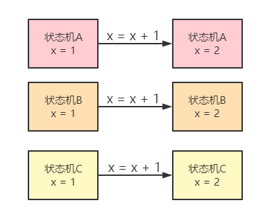
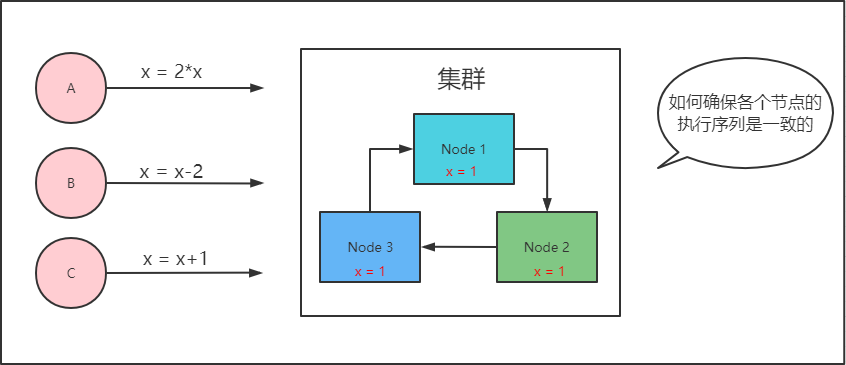
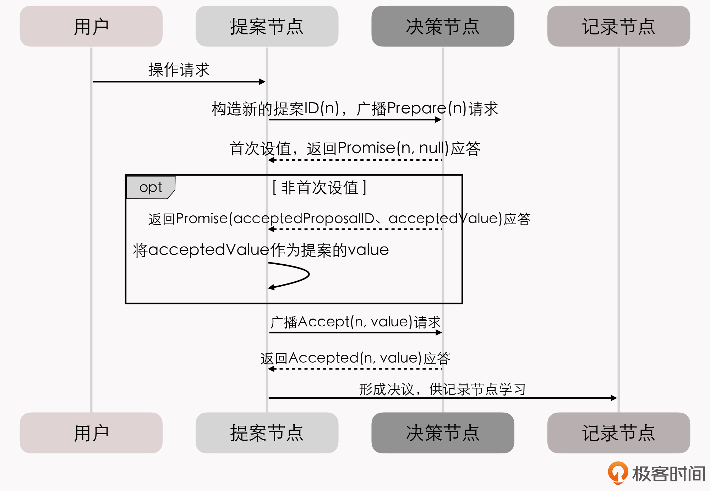
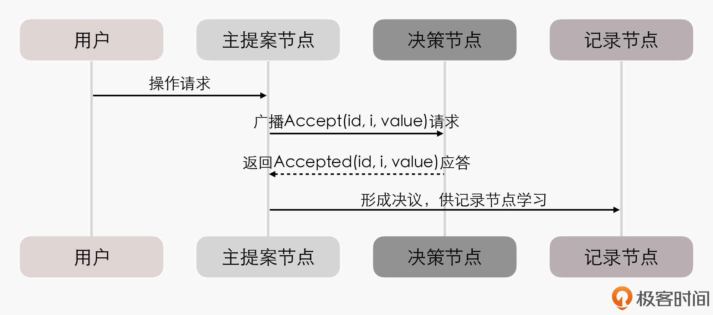
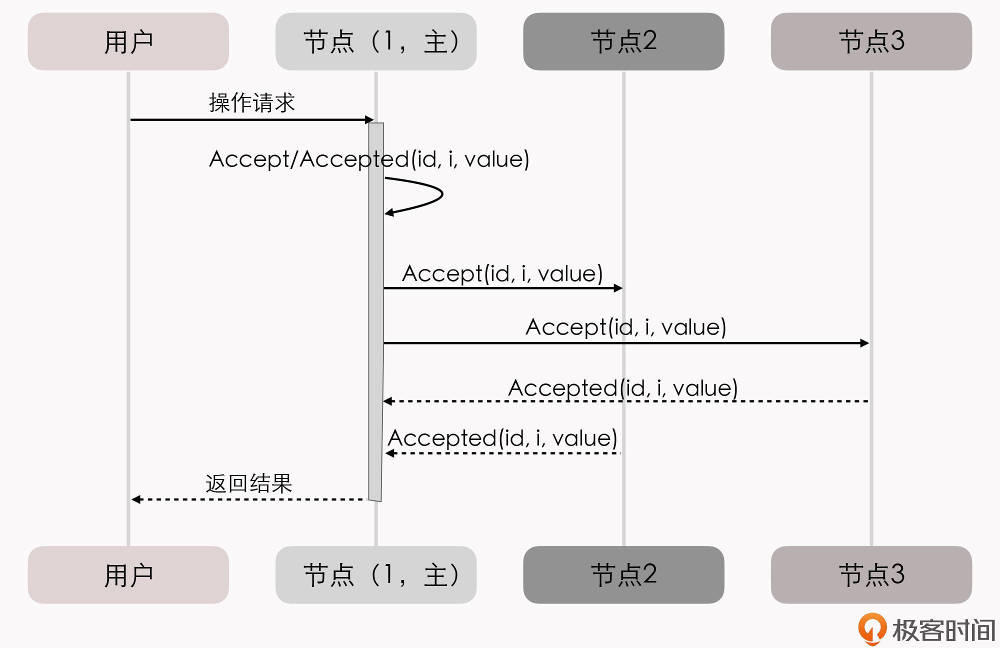

# 分布式共识

## 1. 共识的由来

### 1.1 数据的可靠性

> 如果你有一份很重要的数据，要确保它长期存储在电脑上不会丢失，你会怎么做？

答案就是去买几块磁盘，把数据在不同磁盘上多备份几个副本。

假设一块磁盘每年损坏的概率是 5%，那把文件复制到另一块磁盘上备份后，数据丢失的概率就变成了 0.25%（两块磁盘同时损坏才会导致数据丢失）。以此类推，使用三块磁盘存储数据丢失的概率就是 0.00125%，使用四块则是 0.0000625%。换句话说，使用四块磁盘来保存同一份数据，就已经保证了这份数据在一年内有超过 99.9999% 的概率是安全可靠的。

**在软件系统里，保障系统可靠性的方法，与拿几个磁盘备份并没有什么本质区别。**

单个节点的系统宕机导致无法访问数据的原因可能有很多，比如程序运行出错、硬件损坏、网络分区、电源故障，等等，一年中出现系统宕机的概率也许比 5% 还要大。这就决定了软件系统也必须有多台机器能够拥有**一致的数据副本**，才有可能对外提供可靠的服务。

**在软件系统里，要保障系统的可用性，面临的困难与磁盘备份却又有着本质的区别。**

分布式系统里面，我们就必须考虑动态的数据如何在不可靠的网络通讯条件下，依然能在各个节点之间正确复制的问题。

### 1.2 数据的一致性

> 如果你有一份会随时变动的数据，要确保它能正确地存储在网络中几台不同的机器上，你会怎么做？

这时，你最容易想到的答案一定是**"数据同步"**：

每当数据有变化，就把变化情况在各个节点间的复制看成是一种事务性的操作，只有系统里的每一台机器都反馈成功地完成磁盘写入后，数据的变化才能宣布成功。

 2PC、3PC，就可以实现这种同步操作。同步的一种真实应用场景是，数据库的主从全同步复制（Fully Synchronous Replication）。比如，MySQL Cluster 进行全同步复制时，所有 Slave 节点的 Binlog 都完成写入后，Master 的事务才会进行提交。

不过，这里有一个显而易见的缺陷，尽管可以确保 Master 和 Slave 中的数据是绝对一致的，**但任何一个 Slave 节点、因为任何原因未响应都会阻塞整个事务。也就是说，每增加一个 Slave 节点，整个系统的可用性风险都会增加一分。**

以同步为代表的数据复制方法，叫做**状态转移（State Transfer）**。这类方法属于比较符合人类思维的可靠性保障手段，但通常要以牺牲可用性为代价。

但是，我们在建设分布式系统的时候，往往不能承受这样的代价。对于一些关键系统来说，在必须**保障数据正确可靠的前提下，对可用性的要求也非常苛刻**。比如，系统要保证数据要达到 99.999999% 可靠性，同时也要达到 99.999% 可用的程度。

### 1.3 数据的可用性

> 如果你有一份会随时变动的数据，要确保它正确地存储于网络中的几台不同机器之上，并且要尽可能保证数据是随时可用的，你会怎么做？

系统高可用和高可靠之间的矛盾，是由于增加机器数量反而降低了可用性带来的。

#### 1.3.1 状态机

为缓解这个矛盾，在分布式系统里主流的数据复制方法，是以**操作转移（Operation Transfer）**为基础的:

**通过某种操作，把源状态转换为目标状态。**

能够使用确定的操作，促使状态间产生**确定的转移结果**的计算模型，在计算机科学中被称为**状态机（State Machine）**。

状态机有一个特性：任何初始状态一样的状态机，如果执行的命令序列一样，那么最终达到的状态也一样。

在这里我们可以这么理解这个特性:

- **要让多台机器的最终状态一致，只要确保它们的初始状态和接收到的操作指令都是完全一致的就可以。**
- 无论这个操作指令是新增、修改、删除或者其他任何可能的程序行为，都可以理解为要将一连串的**操作日志**正确地广播给各个分布式节点。
- Redis中的持久化策略中，RDB是数据转移，AOF是操作转移

广播指令与指令执行期间，允许系统内部状态存在不一致的情况，也就是不要求所有节点的每一条指令都是同时开始、同步完成的，**只要求在此期间的内部状态不能被外部观察到，且当操作指令序列执行完成的时候，所有节点的最终的状态是一致的。这种模型，就是状态机复制（State Machine Replication）**。

#### 1.3.2 Quorum机制

在分布式环境下，考虑到网络分区现象是不可能消除的，而且可以不必去追求系统内所有节点在任何情况下的数据状态都一致，所以采用的是“**少数服从多数**”的原则。

也就是说，一旦系统中超过半数的节点完成了状态的转换，就可以认为数据的变化已经被正确地存储在了系统当中。这样就**可以容忍少数（通常是不超过半数）的节点失联，使得增加机器数量可以用来提升系统整体的可用性**。在分布式中，这种思想被叫做**Quorum 机制**。

根据这些讨论，我们需要设计出一种算法；

1. 能够让分布式系统内部可以暂时容忍存在不同的状态，但最终能够保证大多数节点的状态能够达成一致；
2. 能够让分布式系统在外部看来，始终表现出整体一致的结果。

这个让系统各节点不受局部的网络分区、机器崩溃、执行性能或者其他因素影响，能最终表现出整体一致的过程，就是各个节点的协**商共识（Consensus）。**

## 2. Paxos算法

### 2.1 算法流程

#### 2.1.1 算法构成

Paxos 算法将分布式系统中的节点分为提案节点、决策节点和记录节点三类。

- **提案节点：称为 Proposer**，提出对某个值进行设置操作的节点，设置值这个行为就是提案（Proposal）。值一旦设置成功，就是不会丢失也不可变的。需要注意的是，Paxos 是典型的基于操作转移模型而非状态转移模型来设计的算法，**所以这里的“设置值”不要类比成程序中变量的赋值操作，而应该类比成日志记录操作**。因此，我在后面介绍 Raft 算法时，就索性直接把“提案”叫做“日志”了。
- **决策节点：称为 Acceptor**，是应答提案的节点，决定该提案是否可被投票、是否可被接受。**提案一旦得到过半数决策节点的接受，就意味着这个提案被批准（Accept）**。提案被批准，就意味着该值不能再被更改，也不会丢失，且最终所有节点都会接受它。
- **记录节点：被称为 Learner**，不参与提案，也不参与决策，只是单纯地从提案、决策节点中学习已经达成共识的提案。比如，少数派节点从网络分区中恢复时，将会进入这种状态。

在使用 Paxos 算法的分布式系统里，所有的节点都是平等的，它们都可以承担以上某一种或者多种角色。

为了便于确保有明确的多数派，决策节点的数量应该被设定为奇数个，且在系统初始化时，网络中每个节点都知道整个网络所有决策节点的数量、地址等信息。

在分布式环境下，如果说各个节点“就某个值（提案）达成一致”，代表的意思就是**“（在不批准新的提案的情况下）不存在某个时刻有一个值为 A，另一个时刻这个值又为 B 的情景”**。

解决这个问题的复杂度主要来源于一下两点：

1. 系统内部各个节点间的通讯是不可靠的。不论是提案节点还是决策节点，它们发出、收到的信息可能会延迟、也可能会丢失。
2. 系统外部各个用户访问是可并发的。如果系统只会有一个用户，或者每次只对系统进行串行访问，那单纯地应用 Quorum 机制，少数节点服从多数节点，就已经足以保证值被正确地读写了。

我们重点看下第二点“系统外部各个用户访问是可并发的”，即“**分布式环境下并发操作的共享数据**”问题。

> 为了方便理解，我们可以先不考虑是不是在分布式的环境下，只考虑并发操作。
>
> 假设有一个变量 i 当前在系统中存储的数值为 2，同时有外部请求 A、B 分别对系统发送操作指令，“把 i 的值加 1”和“把 i 的值乘 3”。如果不加任何并发控制的话，将可能得到“(2+1)×3=9”和“2×3+1=7”这两种结果。
>
> 因此，对同一个变量的并发修改，必须先加锁后操作，不能让 A、B 的请求被交替处理。这，可以说是程序设计的基本常识了。

在分布式的环境下，还要考虑到分布式系统内，可能在任何时刻出现的通讯故障。

**如果一个节点在取得锁之后、在释放锁之前发生崩溃失联，就会导致整个操作被无限期的等待所阻塞。**

因此，算法中的加锁，就不完全等同于并发控制中以互斥量来实现的加锁，还必须**提供一个其他节点能抢占锁的机制**，以避免因通讯问题而出现死锁的问题。

#### 2.1.2 具体步骤

我们继续看 Paxos 算法是怎么解决并发操作带来的竞争的。

**Paxos 算法包括“准备（Prepare）”和“批准（Accept）”两个阶段。**

第一阶段“准备”（Prepare）就相当于抢占锁的过程。

如果某个提案节点准备发起提案，必须先向所有的决策节点广播一个许可申请（称为 Prepare 请求）。提案节点的 Prepare 请求中会附带一个全局唯一的数字 n 作为提案 ID，决策节点收到后，会给提案节点**两个承诺和一个应答**。

其中，两个承诺是指：

- 承诺不会再接受提案 ID 小于或等于 n 的 Prepare 请求；
- 承诺不会再接受提案 ID 小于 n 的 Accept 请求。

一个应答是指：

- 在不违背以前作出的承诺的前提下，回复已经批准过的提案中 ID 最大的那个提案所设定的值和提案 ID
- 如果该值从来没有被任何提案设定过，则返回空值。

**当提案节点收到了多数派决策节点的应答（称为 Promise 应答）后**，可以开始第二阶段“批准”（Accept）过程。

这时有两种可能的结果：

1. 如果提案节点发现所有响应的决策节点此前都没有批准过这个值（即为空），就说明它是第一个设置值的节点，可以随意地决定要设定的值；**并将自己选定的值与提案 ID，构成一个二元组 (id, value)**，再次广播给全部的决策节点（称为 Accept 请求）。
2. 如果提案节点发现响应的决策节点中，已经有至少一个节点的应答中包含有值了，那它就不能够随意取值了，**必须无条件地从应答中找出提案 ID 最大的那个值并接受，构成一个二元组 (id, maxAcceptValue)**，然后再次广播给全部的决策节点（称为 Accept 请求）。

当每一个决策节点收到 Accept 请求时，**都会在不违背以前作出的承诺的前提下，接收并持久化当前提案 ID 和提案附带的值**。如果违反此前做出的承诺，即收到的提案 ID 并不是决策节点收到过的最大的，那允许直接对此 Accept 请求不予理会。

当提案节点收到了多数派决策节点的应答（称为 Accepted 应答）后，协商结束，共识决议形成，将形成的决议发送给所有记录节点进行学习。

## 3. Multi Paxos算法

> 活锁问题与许多Basic Paxos异常场景中所遭遇的麻烦，都可以看做源于任何一个提案节点都可能完全平等地、与其他节点并发地提出提案而带来的复杂问题。
>
> 为此，提出来一种Paxos的改进版本——Multi Paxos算法，希望能够找到一种两全其美的办法：
>
> 1. 不破坏Paxos中"众节点平等"的原则
> 2. 提案节点中实现主次之分，限制每个节点都有的不受控提案权利

Multi Paxos 对 Basic Paxos 的核心改进是，增加了**“选主”**的过程：

- 提案节点会通过定时轮询（心跳），确定当前网络中的所有节点里是否存在一个主提案节点；
- 一旦没有发现主节点存在，节点就会在心跳超时后使用 Basic Paxos 中定义的准备、批准的两轮网络交互过程，向所有其他节点广播自己希望竞选主节点的请求，希望整个分布式系统对“由我作为主节点”这件事情协商达成一致共识；
- 如果得到了决策节点中多数派的批准，便宣告竞选成功。

当选主完成之后，除非主节点失联会发起重新竞选，**否则就只有主节点本身才能够提出提案**。此时，无论哪个提案节点接收到客户端的操作请求，**都会将请求转发给主节点来完成提案**，而主节点提案的时候，也就无需再次经过准备过程，因为可以视作是经过选举时的那一次准备之后，后续的提案都是对相同提案 ID 的一连串的批准过程。

我们也可以通俗地理解为：选主过后，就不会再有其他节点与它竞争，相当于是处于无并发的环境当中进行的有序操作，所以此时系统中要对某个值达成一致，只需要进行一次批准的交互即可。具体如下序列所示：

你可能会注意到，二元组 (id, value) 已经变成了三元组 (id, i, value)，这是因为需要给主节点增加一个“**任期编号**”，这个编号必须是严格单调递增的，以**应付主节点陷入网络分区后重新恢复，但另外一部分节点仍然有多数派，且已经完成了重新选主的情况，此时必须以任期编号大的主节点为准。**

从整体来看，当节点有了选主机制的支持后，就可以进一步简化节点角色，不必区分提案节点、决策节点和记录节点了，可以统称为“节点”，**节点只有主（Leader）和从（Follower）的区别**。此时的协商共识的时序图如下：

在正常情况下，当客户端向主节点发起一个操作请求后，比如提出“将某个值设置为 X”，数据复制的过程为：

1. 主节点将 X 写入自己的变更日志，但先不提交，接着把变更 X 的信息在下一次心跳包中广播给所有的从节点，并要求从节点回复“确认收到”的消息；
2. 从节点收到信息后，将操作写入自己的变更日志，然后给主节点发送“确认签收”的消息；
3. 主节点收到过半数的签收消息后，提交自己的变更、应答客户端并且给从节点广播“可以提交”的消息；
4. 从节点收到提交消息后提交自己的变更，数据在节点间的复制宣告完成。