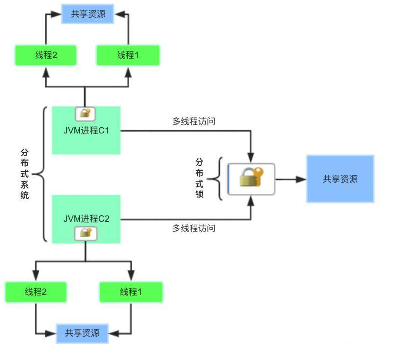
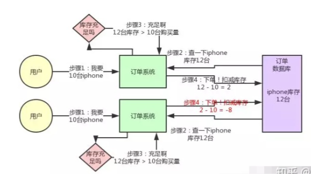
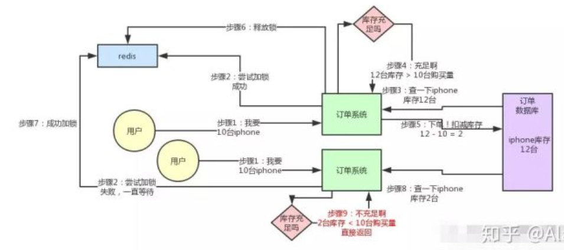
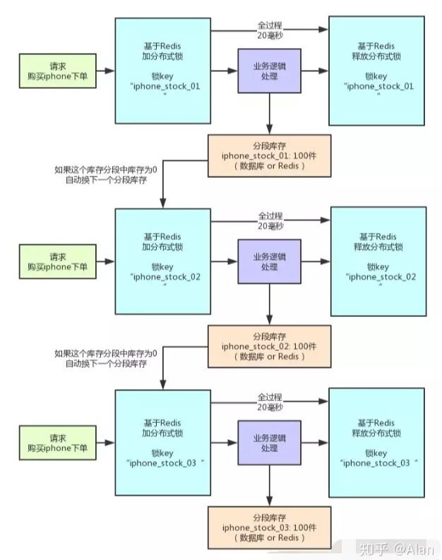

# 分布式锁

## 1. 使用场景

> 在传统的单机服务中，对一些并发场景读取公共资源，例如加减库存，银行卡消费，通过同步或者加锁的方式就可以进行资源控制。这里主要通过线程锁实现：通过给方法、代码块加锁，在同一时刻只有一个线程能够执行该方法和代码块
>
> **线程锁只在同一个JVM中有效，因为线程锁的实现在根本上是靠线程之间共享内存实现的，比如Synchronized、Lock等。**

当应用从单体应用的`单进程多线程`拆分为分布式应用的`多进程多线程`后，**即多个线程可能不在同一个JVM中**，那么之前的解决方案就无法满足需求量，因为JVM提供的原生锁只对JVM里的线程有效，在多机部署场景下失效了。

业界常用的解决方案是借助`分布式锁`或者`数据库原生的悲观锁、乐观锁`来达到不同进程的线程互斥、资源隔离

- 基于Redis的**setnx**或者**redlock**
- 基于Zookeeper的**临时顺序节点**
- 基于数据库**唯一主键**的悲观锁、乐观锁

### 1.2 具体场景

**库存超卖问题：**

- 订单系统部署在两台机器上，不同的用户同时购买10台iphone
- 接着两个订单系统实例都去数据库里查了一下，当前iphone库存是12台。
- 于是每个订单系统实例都发送SQL到数据库里下单，然后扣减了10个库存，其中一个将库存从12台扣减为2台，另外一个将库存从2台扣减为-8台。
- 库存出现了负数！出现了超卖现象

**分布式锁解决超卖问题：**

- 订单系统实例要获取分布式锁，才能进行库存查询，库存更新的操作
- 释放锁之后，其他订单系统实例才能加锁，接着查库存发现只有2台了，库存不足无法购买，下单失败。不会将库存扣减为-8的。

**缺陷：**

高并发场景下，一个订单系统获取了分布式锁执行业务逻辑。其余订单系统必须等待它释放锁之后才能继续执行。

`当前分布式锁以串行化的方式确保了共享资源的安全性，但无法保证系统的高性能`

**优化方式：**

使用分段锁的思想，将库存字段分为多个库存字段，每个字段由一个分布式锁的key负责

- 你现在iphone有1000个库存，那么你完全可以给拆成20个库存段，要是你愿意，可以在数据库的表里建20个库存字段，比如stock_01，stock_02，类似这样的，也可以在redis之类的地方放20个库存key。
- 总之，就是把你的1000件库存给他拆开，每个库存段是50件库存，比如stock_01对应50件库存，stock_02对应50件库存。
- 接着，每秒1000个请求过来了，好！此时其实可以是自己写一个简单的随机算法，每个请求都是随机在20个分段库存里，选择一个进行加锁。
- 同时可以有最多20个下单请求一起执行，每个下单请求锁了一个库存分段，然后在业务逻辑里面，就对数据库或者是Redis中的那个分段库存进行操作即可，包括查库存 -> 判断库存是否充足 -> 扣减库存。
- 这相当于什么呢？相当于一个20毫秒，可以并发处理掉20个下单请求，那么1秒，也就可以依次处理掉20 * 50 = 1000个对iphone的下单请求了。
- 一旦对某个数据做了分段处理之后，有一个坑大家一定要注意：就是如果某个下单请求发现这个分段库存里的库存不足了，此时咋办？
- 这时你得自动释放锁，然后立马换下一个分段库存，再次尝试加锁后尝试处理。这个过程一定要实现

## 2. Redis

> 分布式锁的实现的关键是在分布式应用的服务器外，搭建一个存储锁信息的Redis服务器

### 2.1 实现锁的步骤

1. 指定一个`key`作为锁标志存入redis中，指定一个唯一的值作为`value`
2. 当key不存在时才能存入，确保同一时间只有同一个客户端获得锁，满足**互斥性**
3. 设置一个过期时间，防止因系统异常导致没删除锁，防止**死锁**
4. 当处理完业务需要清除key来释放锁时，需要验证value，只有**加锁的人才能释放锁**

### 2.2 基于SETNX实现

#### 2.2.1 加锁

- redis原生命令

~~~sql
NX:指key不存在就设置成功 value:要确保唯一性，解锁时需要验证value和加锁的一致才删除 PX过期时间
set anyLock unique_value NX PX 30000
~~~

- Lua脚本

~~~lua
// 加锁脚本，KEYS[1] 要加锁的key，ARGV[1]是UUID随机值，ARGV[2]是过期时间
if redis.call('setnx', KEYS[1], ARGV[1]) == 1 then redis.call('pexpire', KEYS[1], ARGV[2]) 
    return 1 
else 
    return 0 
end;
~~~

- Jedis接口

~~~java
// 必须确保加锁和设置过期时间是原子性的
public static boolean lock(Jedis jedis, String lockKey, String requestId, int expireTime){
    String result = jedes.set(lockey, requestId, "NX", "PX", expireTime);
    if("OK".equals(result)){
        return true;
    }
    return false;
}
~~~

基于`Jedis`的`SETNX`保证了**设置锁和过期时间的原子性**，这必须是确保的。

>如果设置锁和设置过期时间这两个操作不是原子性的。
>
>那么假设出现这种情况：
>
>1. 设置了锁
>2. 在设置过期时间前节点就崩溃了
>3. 那么锁没有设置上过期时间，将会出现`死锁`问题

如果锁的时间设置过短，而业务执行时间较长，就会存在锁失效，其他客户端还能获得相同的锁，执行相同的业务，就会出现问题。

因此根据具体的业务需求，设置对应合理的锁过期时间

#### 2.2.2 解锁

- lua脚本

~~~lua
// 解锁脚本，KEYS[1]要解锁的key，ARGV[1]是UUID随机值，检查value是否相同
if redis.call('get', KEYS[1]) == ARGV[1] then 
	return redis.call('del', KEYS[1]) 
else 
    return 0 
end;
~~~

### 2.3 主从架构的问题

假设Redis搭建的部署模式是`主从架构`，由于主节点与从节点的同步采用异步复制，同时没有使用分布式算法保证数据的一致性。

因此对Redis主从架构加锁会出现如下问题：

- 主节点加锁，进行异步复制，锁还未同步完成时主节点崩溃
- 进行节点切换，从节点成为新的主节点
- 由于崩溃时异步复制还未完成，此时新的主节点可以被再次获取锁，因此多个客户端可以同时获取锁

基于这个问题，提出了`RedLock`算法

#### 2.3.1 RedLock

假设Redis的部署模式是`Redis Cluster`，总共有5个独立的master节点。

客户端获取琐时，需要执行一下的步骤

1. 获取当前的时间戳
2. 轮流尝试在master节点上创建锁，一般锁的获取时间较短（便于客户端在当前节点创建锁失败后，继续到下一个节点创建锁）
3. 如果能从大多数节点（N/2+1）中成功获取锁，并且获取锁的时间小于有效时间，那么认为客户端获取了锁
4. 锁的实际有效时间 = 设置锁的有效时间 - 获取锁的时间
5. 如果获取锁失败，N个redis节点都会释放锁

#### 2.3.2 Redisson

Redisson是在redis基础上的开源解决方案，提供了一系列分布式java对象，实现了对锁的封装。

Redisson支持多种Redis部署架构，以下是对redLock算法，即集群架构的分布式锁算法实现