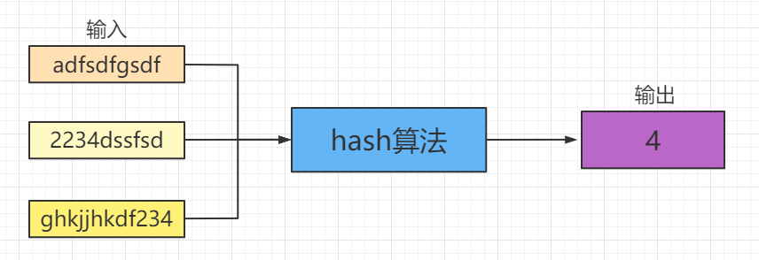

# 哈希(Hash)

## 什么是哈希？

Hash也称为散列，可以把**任意长度**的输入通过散列算法变换成**固定长度**的输入，该输出就是散列值。

简单的说就是将一种任意长度的消息压缩到某一固定长度的消息摘要的函数

哈希的特点：

- 不同的输入可能会散列成相同的输出
- 相同的输入一定会散列成相同的输出
- 输出的空间通常会远小于输入的空间

## 哈希与加密的区别

> 注意：一个常见的误区是哈希 == 加密，但是实际上这两个完全不一样

根据哈希的三个特点，我们可以发现推出哈希的另一个重要特点：

- 哈希是不可逆的

不同的输入可以得到相同的输出

反过来说，给你一个输出，你无法确定输入的值是什么，因为可能有无数个

加密则是可逆的，使用密钥对内容进行加密，反过来也可以使用密钥对加密的内容进行解密

## 哈希冲突

使用hash函数不可避免会造成hash冲突，在hashmap中当不同的key哈希成相同的索引时，会使用链表存储这些不同的key-value对

## 哈希算法

在工程应用中，都使用常见的hash算法将数据运算成固定的值，称为"**摘要**"

常见的hash算法：

- MD5：固定输出128位bit的摘要
- SHA-256：固定输出256位bit的摘要
- SHA-512：固定输出512位bit的摘要

## 哈希的使用场景

1. HashMap：将键key使用哈希函数转换成数组的索引
2. 密码保存：对用户输入的密码使用哈希函数转换成一串字符串，即便数据库被黑客攻击密码也无法破解
3. 校验和：发送方对内容进行哈希得到一个校验和，并与内容一起发送；接收方得到内容后使用相同的哈希算法进行散列并与校验和进行比对，如果与校验和相同则说明内容没有破坏，如果不同则内容不可用