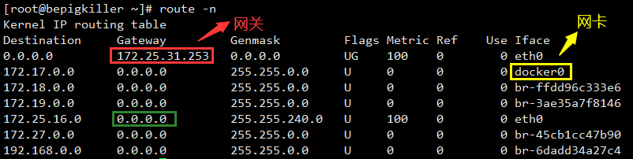
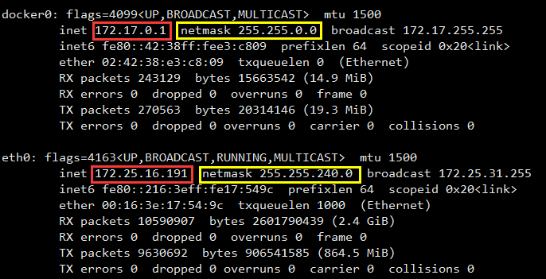
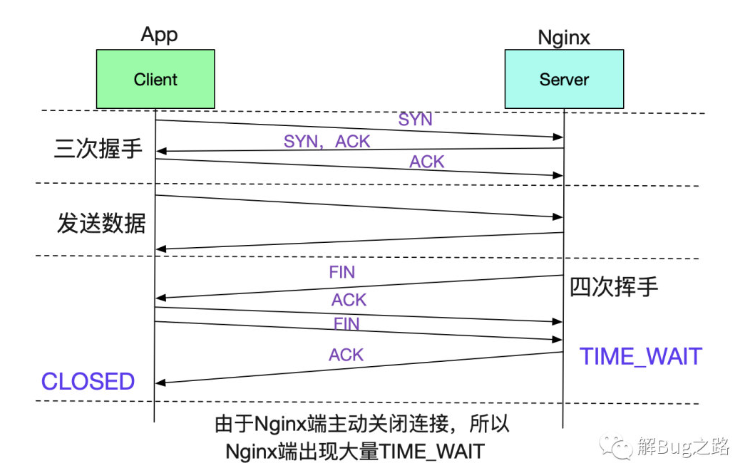
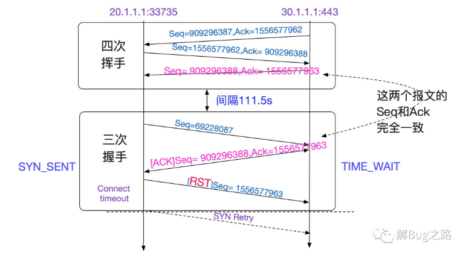
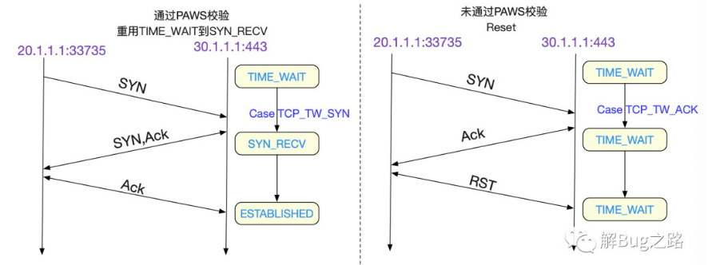
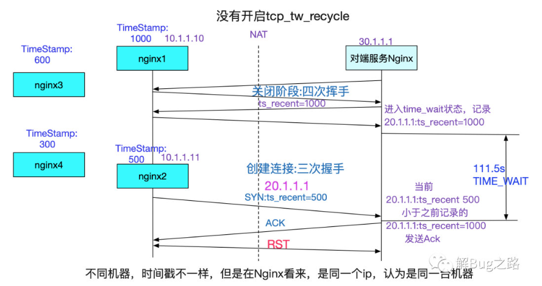
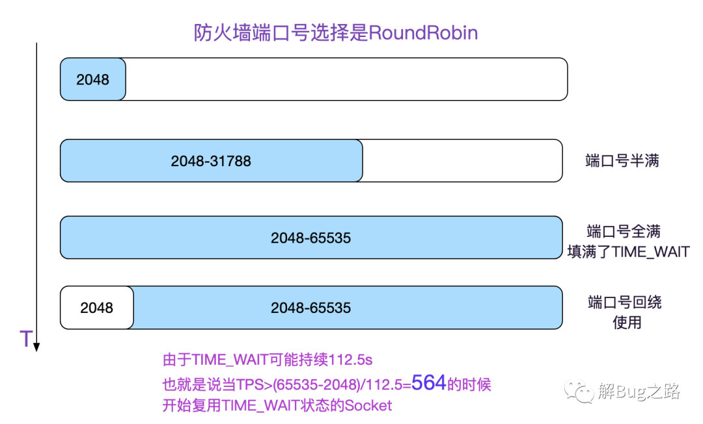
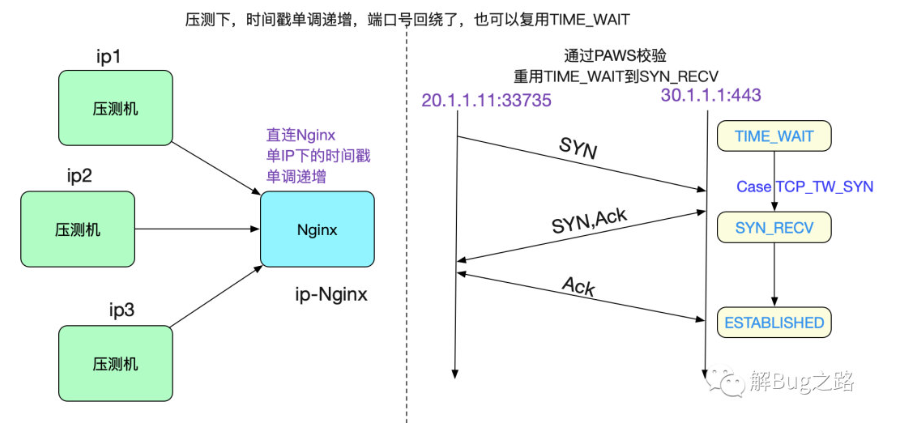
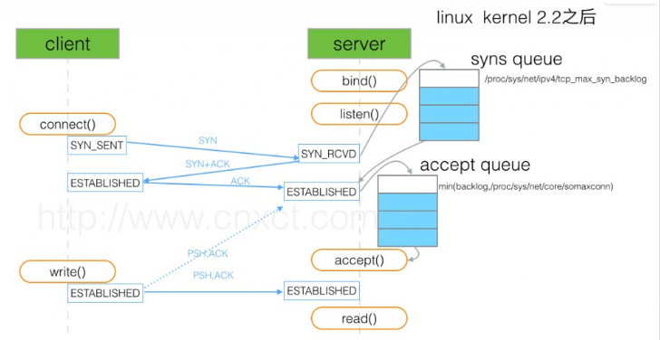

# 计算机网络

## 1. UDP和TCP

### 1.1 TCP

>一个数据在网络中传输，会面临各种各样的问题，常见的如：
>
>- 丢包
>- 重复
>- 错序
>- 网络拥塞
>- 流量拥塞
>
>TCP是可靠的传输，既然可靠就必然解决了这些问题，那它是如何解决的呢？

#### 1.1.1 可靠传输

- 差错校验：

  基于校验和字段完成。【接收方收到报文后用此值判断传输过程中是否出现了比特位错误，有错则丢弃】

- 序列号和应答机制：(**解决重复和错序**)

  将收到的数据根据序列号排序，并且去掉重复的消息（避免接收重复的消息）

  接收方收到消息后，会发送一个ACK报文对传送方进行应答。返回了最大的连续序列号，告诉发送方下次的数据从哪发送（避免发送重复的消息）

- 超时重传：(**解决丢包**)

  发送出去的数据包在指定时间内没有接收到确认包，会被认为丢包了需要重传

- 拥塞控制：(**解决网络拥塞**)

  控制发送方的发送速率来降低整个网络的拥塞程度，TCP主要通过快开始、拥塞避免、快重传、快速恢复四个算法实现

- 流量控制：(**解决流量拥塞**)

  控制发送方的发送速率来保证接收方来得及接受消息，通过接收方的确认报文中的窗口字段来控制发送方发送窗口的大小

#### 1.1.2 拥塞控制

> TCP拥塞控制：整个网络(路由器、交换机)的状态都很拥塞，发送的包无法及时发送到接受方，因此会大量的重传导致网络更加拥塞。

1. 发送方如何知道网络发生了拥塞？

   **ACK的超时重传**。一旦发生超时重传，就可能意味着网络发生了拥塞。

2. 发生了拥塞该如何解决呢？

   发送方会维护一个叫做**拥塞窗口（cwnd）**的状态变量，发送窗口 = Math.min(拥塞窗口、接收窗口)。拥塞窗口会根据网络拥塞的程度根据算法发生变化。

3. 超时重传的设置是动态的：

   RTO(超时重传的时间设置)取决于RTT(往返时间)，RTT取决于过去的时间序列。

   RTTs(new) = (1-a) * RTTs(old) + a*RTT

4. 四个算法：

- 慢开始：拥塞窗口从1开始，每收到一次ACK便加倍
- 拥塞避免：达到阈值ssthresh开始线性增长
- 快重传：一旦收到3次重复的ACK（**网络并不拥塞**）就认为发送的报文已经丢失，进行重传
- 快恢复：快速重传后ssthresh变为cwnd/2，接收cwnd = ssthresh，直接进入拥塞避免阶段

TCP快速重传为什么采用3次冗余ACK，而不是两次或4次？

- 两次冗余ACK很可能是由于分组乱序到达造成的；三次冗余ACK大概率是分组丢包，四次以上的冗余ACK丢包的概率更大。【分组丢包时，肯定会导致3次ACK，因此采用3次作为快速重传的阈值，是实践经验】

#### 1.1.3 流量控制

> TCP流量控制：
>
> 1. 当接受方接收数据的速度比不上发送方发送数据的速度时，多余的包不会处理，由于发送方收不到ACK，因此会不断的重发导致吞吐量浪费。
> 2. 解决方案：接受方在TCP报文中可以设置接受缓冲区的滑动窗口大小，控制发送方的发送速率。
> 3. 在发送方和接收方中，每一方都有本机的发送缓冲区和接受缓冲区，应用层调用write()方法只是将数据发送到了发送缓冲区，调用read()方法只代表从接受缓冲区中读取数据。

发送缓冲区：

1. 已发送并收到ACK
2. 已发送还未收到ACK
3. 还未发送
4. 不允许发送

接受缓冲区：

1. 已收到并被应用程序读取发送了ACK
2. 已经收到和还未收到的数据（因为接受到的数据是乱序的，所以无法区分分界线）
3. 不允许接受

提高吞吐率的方法：

- Nagle算法：延迟发送，只有发送缓冲区的可以发送的数据达到MSS(最大报文段)时，才允许发送，牺牲时间提高吞吐量。(导致粘包问题)
- 延迟ACK：接受方每读取一个数据，不会立即发送ACK，而是等一起ACK或者携带发送方的数据一起发送。

#### 1.1.4 三次握手

- 什么是三次握手：

  1. 第一次握手：客户端发送**同步报文**，并选择一个随机数seq=x作为自己的**初始序列号**，进入`syn-sent`状态，等待服务器响应
  2. 第二次握手：服务器端发送**同步确认**报文、选择一个随机数 seq = y 作为自己的**初始序列号**、**确认号**ack=x+1，进入syn-`received`状态
  3. 第三次握手：客户端发送**确认报文**，序列号seq=x+1，确认号ack = y+1，进入`Established`状态，连接建立

- 为什么是三次握手而不是两次握手

  1. **双方确认了对方的发送、接收能力是正常的**

     第一次握手服务器确认了客户端的发送能力，自己的接受能力是正常的

     第二次握手客户端确认了自己的发送能力和接受能力，服务器端的发送能力和接受能力是正常的

     第三次握手服务器器确认了自己的发送能力和接收能力，客户端的发送能力和接收能力是正常的

  2. **双方确认了自己和对方的序列号，保证了能够进行可靠传输**

  3. **防止过期的连接请求再次向服务器建立连接，浪费服务器资源**

     客户端发送了一个连接请求A到服务器端，但因为网络原因未达到。之后客户端又发送了连接请求，这次成功建立了连接，数据发送完毕之后双方又关闭了连接。此时连接请求A终于到达了服务器，如果此时是两次握手，由于服务器会认为这是一个新的连接，发送了同步确认报文后就进入了Established状态，这是由于客户端已经关闭，不会发送数据给服务器端，服务器只能白白的浪费资源单方面等待客户端。

- Syn泛洪攻击        

  - SYN洪泛攻击是一种典型的**DOS攻击**
  - 原因：攻击方采用IP欺骗的方式伪造大量SYN请求向目标主机发起攻击，**但却不进行第三次握手**，导致目标主机的半连接队列迅速被占满，（半连接队列占用着CPU和内存），从而无法为正常客户连接服务，严重时服务器直接死机。
  - 解决方案：
    - SYN cookie：完成第一次握手后，服务器不在半连接队列中创建连接项，而是将服务器与客户端的IP、端口号、时间戳等信息采用SHA算法加密得到cookie，作为第二次握手的初始序列号发回去。如果第三次握手收到的ack号减一，解码后确认是原来的发送端，则生成连接项，放进全连接队列中。【这样半连接队列相当于无限大】
    - 修改`tcp_max_syn_backlog`参数调大半连接队列长度。
  
- 第三次握手阶段，最后一次ACK包丢失，会发生什么？

  - 服务器端：
    - 服务器端的TCP连接状态为SYN—RECV，并且会根据TCP的超时重传机制，会等待3s、6s、12s重发同步确认报文
    - 如果重发指定次数后，仍未收到客户端的ACK应答，则服务器自动关闭这个连接
  - 客户端：
    - 客户端认为连接已经建立，会发送数据到服务器端，服务器端以**RST**包响应，此时客户端知道第三次握手失败

#### 1.1.5 四次挥手

- 什么是四次挥手
  1. 第一次挥手：客户端发送**释放报文**，序列号为seq=x，主动关闭连接，客户端进入`FIN_WAIT_1`状态
  2. 第二次挥手：服务器发送**确认报文**，确认号为ack=x+1，序列号为seq=y，服务器端进入`CLOSE_WAIT`阶段，客户端收到后进入`FIN_WAIT_2`阶段
  3. 第三次挥手：服务器发送**释放报文**，确认号为ack=x+1，序列号为seq=z，进入服务器端`LAST_ACK`阶段
  4. 第四次挥手：客户端发送**确认报文**，确认号为ack=z+1，序列号为seq=x+1，客户端进入`TIME_WAIT`阶段，服务器收到后进入`CLOSE`阶段，等待2MSL后，客户端也进入`CLOSE`阶段，连接正式关闭
  
- 为什么关闭的时候是四次挥手，连接的时候是三次握手
  - 服务器端接收到客户端的**释放报文**后，只是知道客户端不会再发数据，但服务器端本身还有一些需要处理的数据。因此服务器端会先发一个**确认报文**作出应答，等处理完自己的数据后，再发送**释放报文**
  - 服务器端收到客户端的**同步报文**后，服务器端没有要发送的数据，因此可以将**同步报文**和**确认报文**一同发送

- 客户端为什么要等待2MSL
  1. 确保双方能够正常的关闭连接：
     - 第四次挥手发送的确认报文可能因为网络原因没有到达服务器端，因此服务器会超时重发释放报文，此时如果客户端已经断开，则无法响应服务器的释放请求，服务器就无法正常关闭。
     - **MSL**是报文段在网络中存活的最大时间，客户端等待2MSL就也许可以等到服务器端再次发送的释放报文。如果2MSL内没有收到，则客户端认为服务器端已经收到自己发送的确认报文，正常关闭连接。
  2. 避免旧链接的报文影响相同四元组的新连接
  
- 客户端出现了故障怎么办
  
  - TCP设有一个**保活计时器**，服务器每收到一次客户端的请求，便会重新复位这个计时器，时长为2小时。一旦服务器端2个小时内没有收到客户端的消息，便会**每隔75秒发送探测报文**，如果连续发送10次探测报文客户端都没有回应，服务器就认为连接已经断开了
  
- TIME-WAIT状态过多有什么后果？

  1. 在**高并发短连接**的TCP服务器下，服务器处理完请求后立刻主动关闭请求，这个场景下会有大量的Socket处于`TIME_WAIT`阶段。如果客户端的并发量很高，**此时部分客户端便会显示连接不上**。
  2. 短连接表示"**业务处理+传输数据的时间 远远小于`TimeWait`的时间**"，这会导致服务器浪费资源严重

  综合这两个方面，持续达到一定量的高并发短连接，会使服务器因为端口不足而拒绝为部分客户服务

- 解决方法：

  - 减短TCP_WAIT的等待时间

  - 开启端口重用
  - 增加可用的端口范围
  - **将短连接修改为长连接 Connection : keep-alive**

## 2. HTTPS

在HTTP的基础上使用了SSL-TLS对传输的内容进行加密，保证了内容的安全

### 2.1 对称加密与非对称加密

对称加密：使用相同的密钥对内容进行加密解密

非对称加密：一方使用公钥对内容进行加密，一方使用私钥对内容进行解密

### 2.2 TLS握手过程

1. 客户端发送Client Hello，提供可选择的TLS版本，加密套件和第一个随机数
2. 服务器端发送Server Hello，选择TLS版本，加密套件和第二个随机数
3. 服务器端发送证书 Certificate
4. 服务器端发送公钥 Server Key Exchange
5. 服务器端发送Server Hello Done，表示Server Hello结束
6. 客户端发送Client Key Exchange，Encrypted Handshake Message 把公钥加密后的第三个随机数发送给服务器端
7. 服务器端用私钥解密得到第三个随机数，并发送Encrypted Handshake Message
8. 双方用第一个随机数 + 第二个随机数 + 第三个随机数加密生成会话秘钥，之后便可对传输的内容进行对称加密

### 2.3 证书

> 证书的作用是确保连接的服务器是自己所期望的

当服务器向证书中心申请CA证书后，CA会做如下操作

- CA的操作：
  1. 先通过哈希算法对持有者的公钥、颁发时间、颁发者、有效时间等内容进行哈希散列生成报文摘要
  2. 用私钥对报文摘要进行加密，得到**数字签名**
  3. 将数字签名、主题信息、公钥、签发机构的信息、使用的签名算法一同作为**证书**颁发给接收方

- 客户端在进行第6步前会首先验证服务器端的信息
  1. 用证书机构的公钥对证书中的数字签名进行解密，得到一串字符串A
  2. 用相同的哈希算法计算报文的摘要，得到一串字符串B
  3. 比较A和B，如果相同则证书可信，不同则认为证书不可信

证书包含的内容：

1. 主题信息：
   - 服务器的名称
   - 服务器的地址
   - 服务器的公钥
2. 签发者信息：
   - 机构的地址和名称
   - 证书的序列号
   - 证书的有效期
   - CA对报文的**数字签名**
   - 签名算法

## 3. 综合

### 1. IP寻址

**路由表：**

如果目的IP为172.25.16.9，根据路由表的匹配规则，会匹配到绿色的路径上

~~~bash
172.25.16.0     0.0.0.0         255.255.240.0   U     100    0        0 eth0
~~~

接收到的IP包会通过eth0网卡发送出去，接下来需要判断目标IP与源IP是否处于同一个局域网内

**网卡信息**

使用`ifconfig`查看网卡信息

目标路由走哪张网卡，便使用该网卡的掩码计算源IP与目标IP的网络地址。如果相同则说明两个IP在同一个子网内。

> 路由表中的Gateway是0.0.0.0：
>
> ​	表示源IP与目标IP处于同一个子网内，不需要经过网关可以直接送达

**ARP协议**

网络包在物理层传输的时候使用的是MAC地址而不是IP地址，根据MAC地址决定发送到哪台主机上

ARP协议就是查询IP地址对应的MAC地址。每台OS一般都有arp缓存

~~~bash
[root@bepigkiller ~]# arp -a
_gateway (172.25.31.253) at ee:ff:ff:ff:ff:ff [ether] on eth0
~~~

**两台主机A，B位于同一段局域网内**

4. A在自己的ARP缓存中查找是否有主机B的MAC地址，如果有则添加MAC头部
5. ARP缓存中没有主机B的MAC地址，则在局域网中广播来查询主机B的MAC地址，获得后写入ARP缓存，并添加MAC头部

~~~bash
[root@bepigkiller ~]# tcpdump -i eth0  arp or icmp
dropped privs to tcpdump
tcpdump: verbose output suppressed, use -v or -vv for full protocol decode
listening on eth0, link-type EN10MB (Ethernet), capture size 262144 bytes
13:59:00.340101 ARP, Request who-has bepigkiller tell _gateway, length 28
13:59:00.340125 ARP, Reply bepigkiller is-at 00:16:3e:17:54:9c (oui Unknown), length 28
~~~

**两台主机位于不同的局域网**

1. 如果处于不同的子网，就需要使用路由表的网关IP地址进行转发
4. 如果主机A的缓存中没有网关的MAC地址，则广播查询网关的MAC地址，找到后将目的MAC地址设为网关的MAC地址
3. 网关收到后，如果IP地址与网关处于同一个子网，则在网关的ARP映射表中查找主机B的MAC地址，没有则广播查询
4. 如果IP地址与网关处于不同的子网，则根据网关的路由表查找下一个网关IP的MAC地址，修改目的MAC地址
5. 直到达到目的网络与目的主机

### 2. Time-Wait

> 在高并发短连接的情况下，服务器在每个请求完成后会主动关闭连接，从而造成有大量的TIME_WAIT。
>
> 客户端可能会产生大量的连接失败

我们可以看看Linux关于`TIME_WAIT`处理的内核源码:

~~~java
switch (tcp_timewait_state_process(inet_twsk(sk), skb, th)) {     
    // 如果是TCP_TW_SYN，那么允许此SYN分节重建连接，即允许TIME_WAIT状态跃迁到SYN_RECV     
    case TCP_TW_SYN: {         
        struct sock *sk2 = inet_lookup_listener(dev_net(skb->dev),                             
                                                &tcp_hashinfo,                             
                                                iph->saddr, 
                                                th->source,                             
                                                iph->daddr, 
                                                th->dest,                             
                                                inet_iif(skb));
         if (sk2) {             
                inet_twsk_deschedule(inet_twsk(sk), &tcp_death_row);             												inet_twsk_put(inet_twsk(sk));             
                sk = sk2;             
                goto process;         
          } 
    }     
    // 如果是TCP_TW_ACK，那么，返回记忆中的ACK,这和我们的现象一致     
    case TCP_TW_ACK:         
        tcp_v4_timewait_ack(sk, skb);         
        break;     
    // 如果是TCP_TW_RST直接发送RESET包     
    case TCP_TW_RST:         
        tcp_v4_send_reset(sk, skb);         
        inet_twsk_deschedule(inet_twsk(sk), &tcp_death_row);         
        inet_twsk_put(inet_twsk(sk));         
        goto discard_it;     
    // 如果是TCP_TW_SUCCESS则直接丢弃此包，不做任何响应     
    case TCP_TW_SUCCESS:;     
}     
goto discard_it; 
~~~

调用了`tcp_timewait_state_process`函数，根据方法的结果进行处理

- TCP_TW_SYN：重新建立连接，TIME-WAIT状态直接进入到SYN-RECV阶段
- TCP_TW_ACK：返回**记忆中的ACK**
- TCP_TW_RST：如果是TCP_TW_RST直接发送RESET包 
- TCP_TW_SUCCESS：直接丢弃此包，不做响应

状态的迁移就在于`tcp_timewait_state_process`这个函数,我们着重看下想要观察的分支

~~~java
enum tcp_tw_status tcp_timewait_state_process(
    struct inet_timewait_sock *tw, 
    struct sk_buff *skb,                
    const struct tcphdr *th) {     
    	bool paws_reject = false;
    	......
        // 计算是否通过paws
        paws_reject = tcp_paws_reject(&tmp_opt, th->rst);     
        if (!paws_reject && (TCP_SKB_CB(skb)->seq == tcptw->tw_rcv_nxt 
                 && (TCP_SKB_CB(skb)->seq == TCP_SKB_CB(skb)->end_seq || th->rst))) {         
            ......         
            // 重复的ACK,discard此包         
            return TCP_TW_SUCCESS;     
        }     
        // 如果是SYN分节，而且通过了paws校验     
        if (th->syn && !th->rst && !th->ack && !paws_reject && 
            (after(TCP_SKB_CB(skb)->seq, tcptw->tw_rcv_nxt) || 
             (tmp_opt.saw_tstamp && 
              (s32)(tcptw->tw_ts_recent - tmp_opt.rcv_tsval) < 0))) {         
                ......         
                // 返回TCP_TW_SYN,允许重用TIME_WAIT五元组重新建立连接         
                return TCP_TW_SYN;     
        }     
        // 如果没有通过paws校验，则增加统计参数     
        if (paws_reject)         
            NET_INC_STATS_BH(twsk_net(tw), LINUX_MIB_PAWSESTABREJECTED);     
        if (!th->rst) {         
            // 如果没有通过paws校验，而且这个分节包含ack,则将TIMEWAIT持续时间重新延长         
            // 我们抓包结果的结果没有ACK,只有SYN,所以并不会延长         
            if (paws_reject || th->ack)             
                inet_twsk_schedule(tw, &tcp_death_row, TCP_TIMEWAIT_LEN, TCP_TIMEWAIT_LEN);         
            // 返回TCP_TW_ACK,也即TCP重传ACK到对面         
            return TCP_TW_ACK;
        } 
} 
~~~

PAWS(Protect Againest Wrapped Sequence numbers 防止回绕)校验机制如果生效而拒绝此分节的话，LINUX_MIB_PAWSESTABREJECTED这个统计参数会增加。

**为什么PAWS会通不过？**

~~~java
static inline int tcp_paws_reject(const struct tcp_options_received *rx_opt, int rst) {     
    if (tcp_paws_check(rx_opt, 0))         
        return 0;     
    // 如果是rst，则放松要求，60s没有收到对端报文，认为PAWS检测通过      
    if (rst && get_seconds() >= rx_opt->ts_recent_stamp + TCP_PAWS_MSL)         
        return 0;     
    return 1; 
}  
static inline int tcp_paws_check(const struct tcp_options_received *rx_opt, int paws_win) {      
    // 如果ts_recent中记录的上次报文（SYN）的时间戳，小于当前报文的时间戳（TSval），表明paws检测通过 paws_win = 0     
    if ((s32)(rx_opt->ts_recent - rx_opt->rcv_tsval) <= paws_win)         
        return 1;     
    // 否则，上一次获得ts_recent时间戳的时刻的24天之后，为真表明已经有超过24天没有接收到对端的报文了，认为PAWS检测通过     
    if (unlikely(get_seconds() >= rx_opt->ts_recent_stamp + TCP_PAWS_24DAYS))         
        return 1;      
    return 0; 
} 
~~~

当SYN时间戳比之前挥手的时间戳还小时，PAWS校验不过。
那么为什么会这个SYN时间戳比之前挥手的时间戳还小呢?那当然是NAT的锅喽，NAT把多台机器的ip虚拟成同一个ip。但是多台机器的时间戳(也即从启动开始到现在的时间，非墙上时间),如下图所示:

只有在Server端TIME_WAIT还没有消失时候,重用这个Socket的时候，遇上了反序的时间戳SYN，就会发生这种问题。

由于NAT前面的所有机器时间戳都不相同，所以有很大概率会导致时间戳反序！

**那么什么时候重用TIME_WAIT状态的Socket呢**

防火墙的端口号选择逻辑是RoundRobin的，也即从2048开始一直增长到65535，再回绕到2048,如下图所示:

但我们在线下压测的时候，明显速率远超560tps,那为何确没有这样的问题出现呢。

很简单，是因为TCP_SYN_SUCCESS这个分支，由于我们的压测机没有过NAT，那么时间戳始终保持单IP下的单调递增，即便>560TPS之后，走的也是TCP_SYN_SUCCESS，将TIME_WAIT Socket重用为SYN_RECV，自然不会出现这样的问题，如下图所示:

在ip源和目的地址固定，目的端口号也固定的情况下，五元组的可变量只有ip源端口号了。

源端口号最多是65535个，如果计算保留端口号(0-2048)的话(假设防火墙保留2048个)，那么最多可使用63487个端口。
由于每使用一个端口号，在高负载的情况下，都会产生一个112.5s才消失的TIME_WAIT。那么在63487/112.5也就是564TPS(使用短连接)的情况下，就会复用TIME_WAIT下的Socket，再加上PAWS校验，就会造成大量的连接创建异常！

[解Bug之路-NAT引发的性能瓶颈-完整版 (weibo.com)](https://weibo.com/ttarticle/p/show?id=2309404765157355029311)

### 3. 半连接队列与全连接队列

三次握手中，当server到client发送的连接报文后（第一步），会把连接信息放到半连接队列中，之后给client回复`syn+ack`报文

第三步的时候server收到client的`ack`报文：

- 如果全连接队列未满，将连接的信息从半连接队列移入到全连接队列
- 如果全连接队列已满，则根据tcp_abort_on_overflow指令做处理

~~~bash
[root@bepigkiller ~]# cat /proc/sys/net/ipv4/tcp_abort_on_overflow
0
~~~

tcp_abort_on_overflow的状态：

- 0：放弃客户端发送的`ack`报文，重新发送`syn+ack`报文
- 1：放弃此次连接

> 题外话，比如syn floods 攻击就是针对半连接队列的，攻击方不停地建连接，但是建连接的时候只做第一步，第二步中攻击方收到server的syn+ack后故意扔掉什么也不做，导致server上这个队列满其它正常请求无法进来

**使用ss指令查看全连接的数量**

~~~bash
[root@server ~]# ss -lnt
Recv-Q Send-Q Local Address:Port  Peer Address:Port 
0        50               *:3306             *:* 
~~~

Send-Q表示全连接的数量，Recv-Q表示已经使用的全连接的数量

**使用netstat指令查看缓冲区**

~~~bash
[root@bepigkiller ~]# netstat -tn  
Active Internet connections (w/o servers)
Proto Recv-Q Send-Q Local Address           Foreign Address         State      
tcp        0      0 172.25.16.191:22        36.17.109.30:34000      ESTABLISHED
~~~

netstat的Recv-Q跟ss的完全不一样。

Recv-Q指收到的数据还在缓存中，还没被进程读取，这个值就是还没被进程读取的 bytes；

Send-Q 则是发送队列中没有被远程主机确认的 bytes 数；

**流量控制与这两个队列息息相关**

### 4. 域名解析问题

