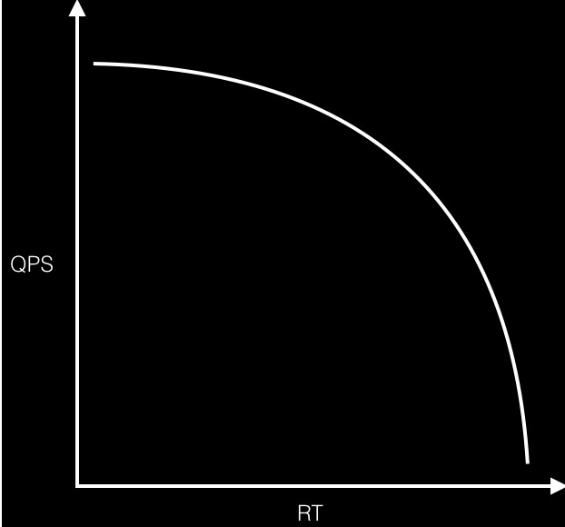

# 高并发系统需要知道的指标

## 1. 基本指标

**1、QPS（Queries Per Second）**

概念：一台服务器每秒能够处理的查询次数。用户发起查询请求到服务器做出响应这算一次，一秒内用户完成了50次查询请求，那此时服务器QPS就是50。

**2、TPS（Transaction Per Second）**

概念：服务器每秒处理的事务数，一个事务是用户发起查询请求到服务器做出响应这算一次。

**划重点，这里就要说清楚一个概念了，在针对单接口，TPS可以认为是等价于QPS的，如访问 `order.html` 这个页面而言，是一个TPS。**

**访问 `order.html` 页面可能请求了3此服务器（如调用了css、js、order接口），这实际就算产生了三个QPS**

所以，总结下就是，在针对单接口的时候TPS = QPS ,否则QPS就要看实际的请求次数了。

**3、RT（Response Time）**

概念：响应时间，就是从客户端请求发起到服务器响应结果的时间。

RT这个参数是系统最重要的指标之一，它的大小直接反应了当前系统的响应状态。基本和咱们用户体验息息相关，现在好一点监控系统一般都有三个RT，即平均、最大、最小。

**3、并发数（Concurrency）**

概念：系统能同时处理的请求的数量，体现了系统的负载能力

举例，请求一个`index.html` 页面，客户端发起了三个请求（css、js、index接口）,那么此时TPS =1 、QPS =3 、并发数 3。

计算公式 ： 

- QPS（TPS）= 并发数/平均响应时间
- 并发数 = QPS\*平均响应时间

**4、吞吐量（Throughput）**

概念：每秒承受的用户访问量，吞吐量和当前请求对CPU消耗、内存、IO使用等等紧密相关。单个处理请求对CPU消耗越高，系统吞吐量越低，反之越高。

系统吞吐量有几个重要指标参数：QPS（TPS）、并发数、响应时间。

一个系统的吞吐量和其TPS 、QPS、并发数息息相关，每个系统针对这些值都有一个相对极限值，只要其中某一个达到最大，系统的吞吐量也就到达极限了。

如此时压力继续增大，系统的吞吐量反而会下降，原因是系统超负荷工作，各种资源切换等等的消耗导致系统性能下降。

**5、PV（Page View）**

概念： 即每个页面的浏览次数，用户每次刷新就算一次。

**6、UV（Unique Visitor）**

概念：独立访客数，每天访问的用户数，此数据需要根据用户唯一标识进行去重。

**7、Load（系统负载）**

概念：此数据指的是Linux系统的负载情况，也就是咱们平时所用Top命令时，最上面显示的数据信息( load average: 0.1, 0.2, 0.5)。此时会显示1分钟、5分钟、15分钟的系统平均Load，很显然load average 的值越低，你的系统负荷越小。

简单的说下这个值应该怎么看，如果你是单核cpu,那此值为1的时候就是系统已经满负荷状态了，需要你马上去解决。但实际经验告诉我们，当系统负荷持续大于0.7的时候（也就是70%），就需要你马上来解决问题了，防止进一步恶化。

为什么需要三个值 load average: 0.1, 0.2, 0.5，其实就是给你个参考。比如只有1分钟的是1，其他俩都是0.1，这表明只是临时突发的现象，问题不大。如果15分钟内，系统负荷都是1或大于1，那表明问题持续存在啊。所以你应该主要观察15分钟的系统负荷。

## 2. 实际举例

我们通过一个实例来把上面几个概念串起来理解。按二八定律来看，如果每天 80% 的访问集中在 20% 的时间里，这 20% 的时间就叫做峰值时间。

- 公式：( 总PV数 * 80% ) / ( 每天秒数 * 20% ) = 峰值时间每秒请求数(QPS)
- 机器：峰值时间每秒QPS / 单台机器的QPS = 需要的机器

1. **每天300w PV 的在单台机器上，这台机器需要多少QPS？**
   ( 3000000 * 0.8 ) / (86400 * 0.2 ) = 139 (QPS)
2. **如果一台机器的QPS是58，需要几台机器来支持？**
   139 / 58 = 3

## 3. 最佳线程数、QPS、RT

**1、单线程QPS公式：QPS=1000 ms/RT**
对同一个系统而言，支持的线程数越多，QPS越高。假设一个RT是80 ms，则可以很容易的计算出QPS，QPS = 1000/80 = 12.5。

多线程场景，如果把服务端的线程数提升到2，那么整个系统的QPS则为 2*（1000/80） = 25，可见QPS随着线程的增加而线性增长，那QPS上不去就加线程呗，**听起来是这个道理，但是往往现实并非如此。**

**2、QPS和RT的真实关系**

**3、最佳线程数量**

- 对于计算密集型的任务，由于线程会长期占用CPU，因此线程池中线程数的大小为N + 1时，能实现最优的利用率

- 对于IO密集型的任务，由于线程会阻塞释放CPU，因此线程池中线程的规模可以更大

要正确的估计线程池的大小，你必须估算出**任务的等待时间与计算时间的比值**
$$
W/C = WaitTime/ComputeTime
$$
要使处理器到达期望的使用率，线程池的最优大小等于：
$$
Nthread=Ncpu*Ucpu*(1+W/C)
$$
可以通过Runtime来获取CPU的数目

~~~java
int N_CPUS = Runtime.getRuntime().availableProcessors();
~~~